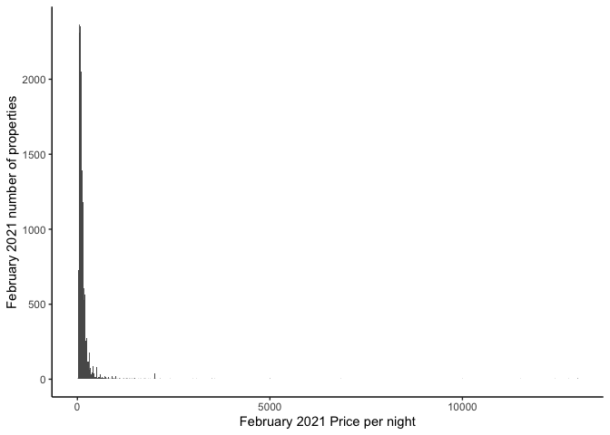
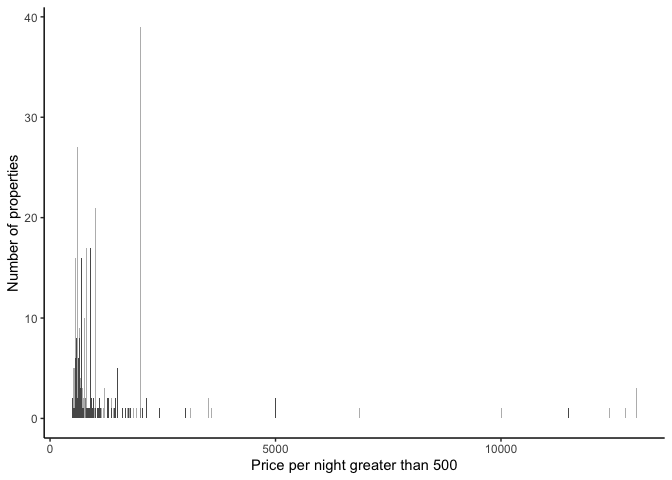
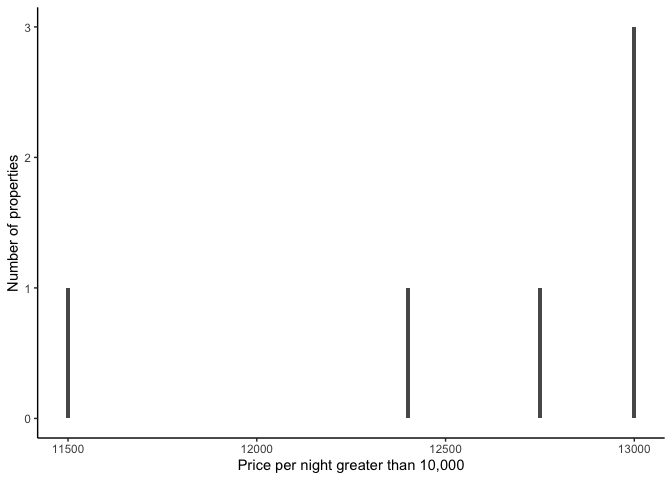
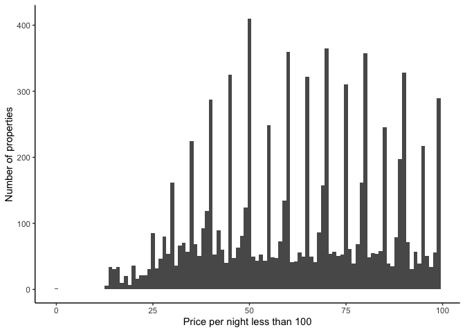
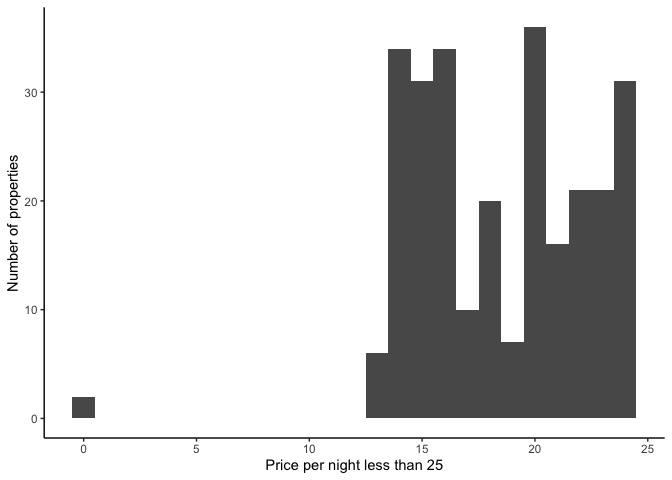
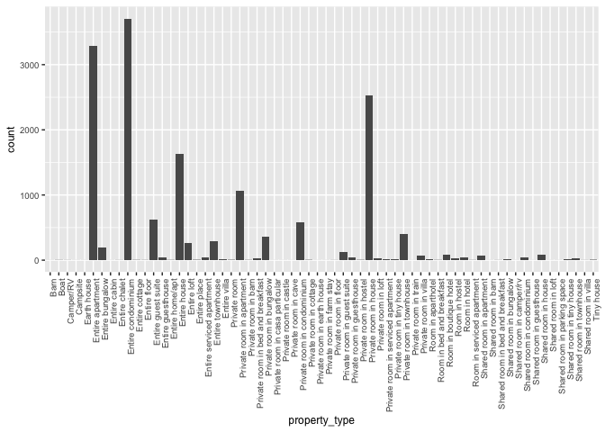
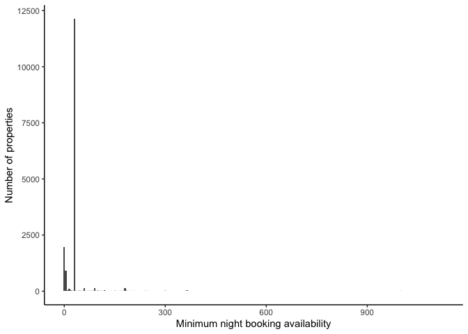
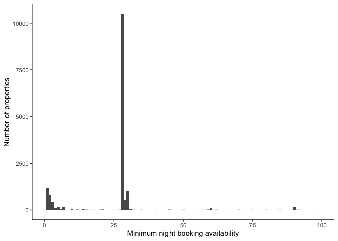

Initial Data Exploration
================
Henry Shiffer

# Data Exploration:

This data is from Inside Airbnb (www.insideairbnb.com) (Cox, 2021). In
this section we will preform some explanatory statistics of Toronto’s
Airbnb data from the month February 2021.

``` r
library(raster)
library(sf)
library(mapview)
library(tidyverse) 
library(tidymodels) 
library(visdat) 
library(ggmap)
```

We can load Toronto’s February 2021 Airbnb data into R by:

``` r
feb_21_airbnb <- read_csv("Airbnb February 2021.csv", guess_max = 20000)
```

To get a high level view of the data and it’s attributes, we can use the
**glimpse()** function from the package **tidyverse**.

``` r
glimpse(feb_21_airbnb)
```

    ## Rows: 15,832
    ## Columns: 74
    ## $ id                                           <dbl> 1419, 8077, 23691, 27423,…
    ## $ listing_url                                  <chr> "https://www.airbnb.com/r…
    ## $ scrape_id                                    <dbl> 2.021021e+13, 2.021021e+1…
    ## $ last_scraped                                 <date> 2021-02-09, 2021-02-09, …
    ## $ name                                         <chr> "Beautiful home in amazin…
    ## $ description                                  <chr> "This large, family home …
    ## $ neighborhood_overview                        <chr> "The apartment is located…
    ## $ picture_url                                  <chr> "https://a0.muscache.com/…
    ## $ host_id                                      <dbl> 1565, 22795, 93825, 11812…
    ## $ host_url                                     <chr> "https://www.airbnb.com/u…
    ## $ host_name                                    <chr> "Alexandra", "Kathie & La…
    ## $ host_since                                   <date> 2008-08-08, 2009-06-22, …
    ## $ host_location                                <chr> "Vancouver, British Colum…
    ## $ host_about                                   <chr> "I live in Vancouver, Can…
    ## $ host_response_time                           <chr> "N/A", "N/A", "N/A", "N/A…
    ## $ host_response_rate                           <chr> "N/A", "N/A", "N/A", "N/A…
    ## $ host_acceptance_rate                         <chr> "N/A", "N/A", "N/A", "N/A…
    ## $ host_is_superhost                            <lgl> FALSE, FALSE, FALSE, FALS…
    ## $ host_thumbnail_url                           <chr> "https://a0.muscache.com/…
    ## $ host_picture_url                             <chr> "https://a0.muscache.com/…
    ## $ host_neighbourhood                           <chr> "Commercial Drive", "Harb…
    ## $ host_listings_count                          <dbl> 1, 2, 2, 1, 2, 3, 2, 13, …
    ## $ host_total_listings_count                    <dbl> 1, 2, 2, 1, 2, 3, 2, 13, …
    ## $ host_verifications                           <chr> "['email', 'phone', 'revi…
    ## $ host_has_profile_pic                         <lgl> TRUE, TRUE, TRUE, TRUE, T…
    ## $ host_identity_verified                       <lgl> TRUE, FALSE, TRUE, TRUE, …
    ## $ neighbourhood                                <chr> "Toronto, Ontario, Canada…
    ## $ neighbourhood_cleansed                       <chr> "Little Portugal", "Water…
    ## $ neighbourhood_group_cleansed                 <lgl> NA, NA, NA, NA, NA, NA, N…
    ## $ latitude                                     <dbl> 43.64617, 43.64105, 43.69…
    ## $ longitude                                    <dbl> -79.42451, -79.37628, -79…
    ## $ property_type                                <chr> "Entire house", "Private …
    ## $ room_type                                    <chr> "Entire home/apt", "Priva…
    ## $ accommodates                                 <dbl> 10, 2, 3, 1, 2, 5, 2, 4, …
    ## $ bathrooms                                    <lgl> NA, NA, NA, NA, NA, NA, N…
    ## $ bathrooms_text                               <chr> "3 baths", "1.5 baths", "…
    ## $ bedrooms                                     <dbl> 5, 1, 1, NA, 1, 2, NA, 3,…
    ## $ beds                                         <dbl> 7, 1, 1, 1, 2, 2, 1, 3, 2…
    ## $ amenities                                    <chr> "[\"TV\", \"Washer\", \"H…
    ## $ price                                        <chr> "$469.00", "$96.00", "$72…
    ## $ minimum_nights                               <dbl> 28, 180, 28, 365, 180, 30…
    ## $ maximum_nights                               <dbl> 730, 365, 28, 365, 365, 3…
    ## $ minimum_minimum_nights                       <dbl> 28, 180, 28, 365, 180, 30…
    ## $ maximum_minimum_nights                       <dbl> 28, 180, 28, 365, 180, 30…
    ## $ minimum_maximum_nights                       <dbl> 730, 365, 28, 365, 365, 1…
    ## $ maximum_maximum_nights                       <dbl> 730, 365, 28, 365, 365, 1…
    ## $ minimum_nights_avg_ntm                       <dbl> 28, 180, 28, 365, 180, 30…
    ## $ maximum_nights_avg_ntm                       <dbl> 730, 365, 28, 365, 365, 1…
    ## $ calendar_updated                             <lgl> NA, NA, NA, NA, NA, NA, N…
    ## $ has_availability                             <lgl> TRUE, TRUE, TRUE, TRUE, T…
    ## $ availability_30                              <dbl> 0, 30, 28, 11, 30, 11, 23…
    ## $ availability_60                              <dbl> 0, 60, 58, 41, 60, 41, 53…
    ## $ availability_90                              <dbl> 0, 90, 88, 71, 90, 71, 83…
    ## $ availability_365                             <dbl> 0, 365, 362, 346, 365, 34…
    ## $ calendar_last_scraped                        <date> 2021-02-09, 2021-02-09, …
    ## $ number_of_reviews                            <dbl> 7, 169, 217, 26, 1, 111, …
    ## $ number_of_reviews_ltm                        <dbl> 0, 0, 0, 0, 0, 2, 2, 0, 1…
    ## $ number_of_reviews_l30d                       <dbl> 0, 0, 0, 0, 0, 0, 1, 0, 0…
    ## $ first_review                                 <date> 2015-07-19, 2009-08-20, …
    ## $ last_review                                  <date> 2017-12-04, 2013-08-27, …
    ## $ review_scores_rating                         <dbl> 100, 97, 95, 98, 100, 92,…
    ## $ review_scores_accuracy                       <dbl> 10, 10, 10, 10, NA, 9, 10…
    ## $ review_scores_cleanliness                    <dbl> 10, 10, 10, 10, NA, 9, 9,…
    ## $ review_scores_checkin                        <dbl> 10, 10, 10, 10, NA, 10, 1…
    ## $ review_scores_communication                  <dbl> 10, 10, 10, 10, NA, 10, 1…
    ## $ review_scores_location                       <dbl> 10, 10, 9, 10, NA, 9, 9, …
    ## $ review_scores_value                          <dbl> 10, 10, 10, 10, NA, 9, 10…
    ## $ license                                      <chr> NA, NA, NA, NA, NA, NA, N…
    ## $ instant_bookable                             <lgl> FALSE, TRUE, TRUE, FALSE,…
    ## $ calculated_host_listings_count               <dbl> 1, 2, 2, 1, 2, 4, 2, 13, …
    ## $ calculated_host_listings_count_entire_homes  <dbl> 1, 1, 0, 1, 1, 4, 2, 13, …
    ## $ calculated_host_listings_count_private_rooms <dbl> 0, 1, 2, 0, 1, 0, 0, 0, 1…
    ## $ calculated_host_listings_count_shared_rooms  <dbl> 0, 0, 0, 0, 0, 0, 0, 0, 0…
    ## $ reviews_per_month                            <dbl> 0.10, 1.21, 1.66, 0.20, 0…

## Exploring Prices

We can see that the price column contains both dollar signs and commas
when the data was scraped. We are going to want to remove the dollar
signs and commas and convert these values to integers to be able to
graph these values.

``` r
glimpse(feb_21_airbnb$price)
```

    ##  chr [1:15832] "$469.00" "$96.00" "$72.00" "$45.00" "$128.00" "$100.00" ...

Now for cleaning the price column by removing all dollar signs and
commas and converting these values to integers.

``` r
feb_21_airbnb <- feb_21_airbnb %>% 
  mutate(price = str_remove(price, "\\$"),
         price = str_remove(price, ","),
         price = as.integer(price)
         )
glimpse(feb_21_airbnb$price)
```

    ##  int [1:15832] 469 96 72 45 128 100 70 113 93 101 ...

We can plot the Airbnb price per night data on the X-axis with number of
properties having that price per night on the Y-axis. It can be observed
that the distribution is strongly right skewed. We can examine if this
skew still exists zooming in closer at the prices per night.

``` r
feb_21_airbnb %>%
  ggplot(aes(x = price)) +
  geom_histogram(binwidth = 20) +
  theme_classic() +
  labs(x = "February 2021 Price per night",
       y = "February 2021 number of properties")
```

<!-- -->

It is clear there are definitely some outliers existing in price per
night. We can split the data and look at prices per night greater than
$500 and less than $500.

``` r
feb_21_airbnb %>%
  filter(price > 500) %>% 
  ggplot(aes(x = price)) +
  geom_histogram(binwidth = 10) +
  theme_classic() +
  labs(x = "Price per night greater than 500",
       y = "Number of properties")
```

<!-- -->

The right skew still exists when examining price per night greater than
500. As we have a much better view of the outliers, we can see that
there exists properties that are greater than $10,000 a night.

We can can get a better view of these higher end prices by examining the
amount of properties greater than $10,000 a night.

``` r
feb_21_airbnb %>%
  filter(price > 10000) %>% 
  ggplot(aes(x = price)) +
  geom_histogram(binwidth = 10) +
  theme_classic() +
  labs(x = "Price per night greater than 10,000",
       y = "Number of properties")
```

<!-- -->

It appears that the highest price in February 2021 is $13,000 a night,
and there are 3 properties that have this price.

We can take a look at the property types that are $13,000:

``` r
price_13000_listings <- subset(feb_21_airbnb, price == 13000)
price_13000_listings <- subset.data.frame(select = c("price",
                                                     "neighbourhood",
                                                     "name",
                                                     "property_type",
                                                     "room_type",
                                                     "host_id",
                                                     "minimum_nights",
                                                     "maximum_nights",
                                                     "bedrooms"),
                                          price_13000_listings)
price_13000_listings
```

    ## # A tibble: 3 x 9
    ##   price neighbourhood  name      property_type  room_type host_id minimum_nights
    ##   <int> <chr>          <chr>     <chr>          <chr>       <dbl>          <dbl>
    ## 1 13000 NA             Modern U… Entire condom… Entire h…  1.47e8             28
    ## 2 13000 Toronto, Onta… Amazing … Entire bungal… Entire h…  2.16e8            365
    ## 3 13000 Toronto, Onta… ☆2 Bedro… Entire condom… Entire h…  1.85e8             28
    ## # … with 2 more variables: maximum_nights <dbl>, bedrooms <dbl>

We can see that the properties that have the price of $13,000 per night
are entire condominiums and bungalows. However, despite the high price
of the properties, these prices have 1 to 2 bedrooms.

Now we can look at properties less than $500.

``` r
feb_21_airbnb %>%
  filter(price < 500) %>% 
  ggplot(aes(x = price)) +
  geom_histogram(binwidth = 1) +
  theme_classic() +
  labs(x = "Price per night less than 500",
       y = "Number of properties")
```

<!-- -->

We can see a majority of prices are less than $100 a night.

We can take a further look at these values less than $100.

``` r
feb_21_airbnb %>%
  filter(price < 100) %>% 
  ggplot(aes(x = price)) +
  geom_histogram(binwidth = 1) +
  theme_classic() +
  labs(x = "Price per night less than 100",
       y = "Number of properties")
```

<!-- -->

To get a sense of the trends in the most affordable Airbnbs, we can zoom
on the properties that are less than $25 per night.

``` r
feb_21_airbnb %>%
  filter(price < 25) %>% 
  ggplot(aes(x = price)) +
  geom_histogram(binwidth = 1) +
  theme_classic() +
  labs(x = "Price per night less than 25",
       y = "Number of properties")
```

<!-- -->

It can be examined that a majority of properties that are less than $25
per night are around $20 per night. We can also see that there exists
some properties that are $0. It is very unlikely that there are actually
Airbnb’s that are $0.

It makes sense to take a look at these properties that have a price of
$0 more closely.

``` r
price_0_listings <- subset(feb_21_airbnb, price == 0)
price_0_listings <- subset.data.frame(select = c("price", "neighbourhood", "name","property_type", "room_type", "host_id", "minimum_nights", "maximum_nights"), price_0_listings)
price_0_listings
```

    ## # A tibble: 2 x 8
    ##   price neighbourhood name        property_type room_type host_id minimum_nights
    ##   <int> <chr>         <chr>       <chr>         <chr>       <dbl>          <dbl>
    ## 1     0 NA            Residence … Room in hotel Hotel ro…  3.32e8             28
    ## 2     0 NA            Residence … Room in apar… Hotel ro…  3.17e8             28
    ## # … with 1 more variable: maximum_nights <dbl>

Both properties that have a price of $0 per night are hotel rooms in the
“Residence & Conference Centre” in Toronto. It also seems that both
properties are listed by different hosts as there are different host
identification numbers. We can see for both a person can stay for a
minimum of 28 nights and for a maximum of 365 nights.

An Airbnb listing for $0 per night is very untrustworthy. These may be
data-collection errors, or scams.

However, it is possible that these units in this building may be
affordable housing alternatives and a great deal!

## Property Type

We can get a better view of property types and the amount of properties
of each type.

``` r
ggplot(feb_21_airbnb, aes(property_type)) + geom_bar(binwidth = 100, stat = "count") + theme(text = element_text(size=9), axis.text.x = element_text(angle=90, hjust=1))
```

    ## Warning: Ignoring unknown parameters: binwidth

<!-- -->

We can see from this visual that entire apartment and entire condominium
are the most represented Toronto Airbnb property types for February
2021.

We can also check which property type has the lowest representation.

## Nights able to stay:

We can also gain a view of the minimum amount of nights available to
book a stay at the Airbnb.

``` r
feb_21_airbnb %>%
  ggplot(aes(x = minimum_nights)) +
  geom_histogram(binwidth = 5) +
  theme_classic() +
  labs(x = "Minimum night booking availability",
       y = "Number of properties")
```

<!-- -->

We can zoom in on properties that have a 100 night minimum booking or
less.

``` r
feb_21_airbnb %>%
  filter(minimum_nights < 100) %>% 
  ggplot(aes(x = minimum_nights)) +
  geom_histogram(binwidth = 1) +
  theme_classic() +
  labs(x = "Minimum night booking availability",
       y = "Number of properties")
```

<!-- -->

\#Compare March 2020 to April 2020 when recieve April 2020 data

We can see that the majority of properties have a minimum amount of
night booking of around 28. This makes sense as in April 2020, Ontario
had banned all short term rentals (a rental period of less than 28 days)
unless the unit is being rented to someone in need of housing during the
“Emergency Order”.

## Mapping Prices:

To see how prices in February 2021 compare to the pre-pandemic months of
February 2019 and February 2020. We can load this data into R and map
these 3 month’s prices

``` r
feb_19_airbnb <- read_csv("Airbnb February 2019.csv", guess_max = 20000)
feb_20_airbnb <- read_csv("Airbnb February 2020.csv", guess_max = 20000)
```

We can now clean the price column of both February 2019 and February
2020, like we did for February 2021.

``` r
feb_19_airbnb <- feb_19_airbnb %>% 
  mutate(price = str_remove(price, "\\$"),
         price = str_remove(price, ","),
         price = as.integer(price)
         )

feb_20_airbnb <- feb_20_airbnb %>% 
  mutate(price = str_remove(price, "\\$"),
         price = str_remove(price, ","),
         price = as.integer(price)
         )
```

We can plot the prices of February 2019, February 2020, and February
2021 on a map of Toronto.

``` r
feb_19_airbnb_sf <- st_as_sf(feb_19_airbnb, coords = c("longitude", "latitude"), crs = 4326)
feb_20_airbnb_sf <- st_as_sf(feb_20_airbnb, coords = c("longitude", "latitude"), crs = 4326)
feb_21_airbnb_sf <- st_as_sf(feb_21_airbnb, coords = c("longitude", "latitude"), crs = 4326)
```

``` r
mapview(feb_19_airbnb_sf, zcol = "price", legend = TRUE)
```

    ## PhantomJS not found. You can install it with webshot::install_phantomjs(). If it is installed, please make sure the phantomjs executable can be found via the PATH variable.

<div id="htmlwidget-9230a61676626773742d" style="width:672px;height:480px;" class="leaflet html-widget"></div>
<script type="application/json" data-for="htmlwidget-9230a61676626773742d">{"x":{"options":{"minZoom":1,"maxZoom":52,"crs":{"crsClass":"L.CRS.EPSG3857","code":null,"proj4def":null,"projectedBounds":null,"options":{}},"preferCanvas":true,"bounceAtZoomLimits":false,"maxBounds":[[[-90,-370]],[[90,370]]]},"calls":[{"method":"addProviderTiles","args":["CartoDB.Positron","CartoDB.Positron","CartoDB.Positron",{"errorTileUrl":"","noWrap":false,"detectRetina":false,"pane":"tilePane"}]},{"method":"addProviderTiles","args":["CartoDB.DarkMatter","CartoDB.DarkMatter","CartoDB.DarkMatter",{"errorTileUrl":"","noWrap":false,"detectRetina":false,"pane":"tilePane"}]},{"method":"addProviderTiles","args":["OpenStreetMap","OpenStreetMap","OpenStreetMap",{"errorTileUrl":"","noWrap":false,"detectRetina":false,"pane":"tilePane"}]},{"method":"addProviderTiles","args":["Esri.WorldImagery","Esri.WorldImagery","Esri.WorldImagery",{"errorTileUrl":"","noWrap":false,"detectRetina":false,"pane":"tilePane"}]},{"method":"addProviderTiles","args":["OpenTopoMap","OpenTopoMap","OpenTopoMap",{"errorTileUrl":"","noWrap":false,"detectRetina":false,"pane":"tilePane"}]},{"method":"addFlatGeoBuf","args":["feb_19_airbnb_sf-price","feb_19_airbnb_sf - price",null,true,"price",{"radius":6,"stroke":true,"color":"#333333","weight":1,"opacity":0.9,"fill":true,"fillColor":null,"fillOpacity":0.6},{"className":""},"mapview-popup",{"radius":{"to":[3,15],"from":[3,15]},"weight":{"to":[1,10],"from":[1,10]},"opacity":{"to":[0,1],"from":[0,1]},"fillOpacity":{"to":[0,1],"from":[0,1]}}]},{"method":"addScaleBar","args":[{"maxWidth":100,"metric":true,"imperial":true,"updateWhenIdle":true,"position":"bottomleft"}]},{"method":"addHomeButton","args":[-79.624872592973,43.5867129137475,-79.1278117553926,43.8338555831268,"feb_19_airbnb_sf - price","Zoom to feb_19_airbnb_sf - price","<strong> feb_19_airbnb_sf - price <\/strong>","bottomright"]},{"method":"addLayersControl","args":[["CartoDB.Positron","CartoDB.DarkMatter","OpenStreetMap","Esri.WorldImagery","OpenTopoMap"],"feb_19_airbnb_sf - price",{"collapsed":true,"autoZIndex":true,"position":"topleft"}]},{"method":"addLegend","args":[{"colors":["#4B0055 , #4B0055 0%, #393A79 15.2671755725191%, #006892 30.5343511450382%, #009197 45.8015267175573%, #00B488 61.0687022900763%, #60CE63 76.3358778625954%, #CDE030 91.6030534351145%, #FDE333 "],"labels":["0","2,000","4,000","6,000","8,000","10,000","12,000"],"na_color":null,"na_label":"NA","opacity":1,"position":"topright","type":"numeric","title":"feb_19_airbnb_sf - price","extra":{"p_1":0,"p_n":0.916030534351145},"layerId":null,"className":"info legend","group":"feb_19_airbnb_sf - price"}]}],"fitBounds":[43.5867129137475,-79.624872592973,43.8338555831268,-79.1278117553926,[]]},"evals":[],"jsHooks":{"render":[{"code":"function(el, x, data) {\n  return (\n      function(el, x, data) {\n      // get the leaflet map\n      var map = this; //HTMLWidgets.find('#' + el.id);\n      // we need a new div element because we have to handle\n      // the mouseover output separately\n      // debugger;\n      function addElement () {\n      // generate new div Element\n      var newDiv = $(document.createElement('div'));\n      // append at end of leaflet htmlwidget container\n      $(el).append(newDiv);\n      //provide ID and style\n      newDiv.addClass('lnlt');\n      newDiv.css({\n      'position': 'relative',\n      'bottomleft':  '0px',\n      'background-color': 'rgba(255, 255, 255, 0.7)',\n      'box-shadow': '0 0 2px #bbb',\n      'background-clip': 'padding-box',\n      'margin': '0',\n      'padding-left': '5px',\n      'color': '#333',\n      'font': '9px/1.5 \"Helvetica Neue\", Arial, Helvetica, sans-serif',\n      'z-index': '700',\n      });\n      return newDiv;\n      }\n\n\n      // check for already existing lnlt class to not duplicate\n      var lnlt = $(el).find('.lnlt');\n\n      if(!lnlt.length) {\n      lnlt = addElement();\n\n      // grab the special div we generated in the beginning\n      // and put the mousmove output there\n\n      map.on('mousemove', function (e) {\n      if (e.originalEvent.ctrlKey) {\n      if (document.querySelector('.lnlt') === null) lnlt = addElement();\n      lnlt.text(\n                           ' lon: ' + (e.latlng.lng).toFixed(5) +\n                           ' | lat: ' + (e.latlng.lat).toFixed(5) +\n                           ' | zoom: ' + map.getZoom() +\n                           ' | x: ' + L.CRS.EPSG3857.project(e.latlng).x.toFixed(0) +\n                           ' | y: ' + L.CRS.EPSG3857.project(e.latlng).y.toFixed(0) +\n                           ' | epsg: 3857 ' +\n                           ' | proj4: +proj=merc +a=6378137 +b=6378137 +lat_ts=0.0 +lon_0=0.0 +x_0=0.0 +y_0=0 +k=1.0 +units=m +nadgrids=@null +no_defs ');\n      } else {\n      if (document.querySelector('.lnlt') === null) lnlt = addElement();\n      lnlt.text(\n                      ' lon: ' + (e.latlng.lng).toFixed(5) +\n                      ' | lat: ' + (e.latlng.lat).toFixed(5) +\n                      ' | zoom: ' + map.getZoom() + ' ');\n      }\n      });\n\n      // remove the lnlt div when mouse leaves map\n      map.on('mouseout', function (e) {\n      var strip = document.querySelector('.lnlt');\n      if( strip !==null) strip.remove();\n      });\n\n      };\n\n      //$(el).keypress(67, function(e) {\n      map.on('preclick', function(e) {\n      if (e.originalEvent.ctrlKey) {\n      if (document.querySelector('.lnlt') === null) lnlt = addElement();\n      lnlt.text(\n                      ' lon: ' + (e.latlng.lng).toFixed(5) +\n                      ' | lat: ' + (e.latlng.lat).toFixed(5) +\n                      ' | zoom: ' + map.getZoom() + ' ');\n      var txt = document.querySelector('.lnlt').textContent;\n      console.log(txt);\n      //txt.innerText.focus();\n      //txt.select();\n      setClipboardText('\"' + txt + '\"');\n      }\n      });\n\n      }\n      ).call(this.getMap(), el, x, data);\n}","data":null},{"code":"function(el, x, data) {\n  return (function(el,x,data){\n           var map = this;\n\n           map.on('keypress', function(e) {\n               console.log(e.originalEvent.code);\n               var key = e.originalEvent.code;\n               if (key === 'KeyE') {\n                   var bb = this.getBounds();\n                   var txt = JSON.stringify(bb);\n                   console.log(txt);\n\n                   setClipboardText('\\'' + txt + '\\'');\n               }\n           })\n        }).call(this.getMap(), el, x, data);\n}","data":null}]}}</script>

``` r
mapview(feb_20_airbnb_sf, zcol = "price", legend = TRUE)
```

<div id="htmlwidget-74e1fb7f35b7d07eada5" style="width:672px;height:480px;" class="leaflet html-widget"></div>
<script type="application/json" data-for="htmlwidget-74e1fb7f35b7d07eada5">{"x":{"options":{"minZoom":1,"maxZoom":52,"crs":{"crsClass":"L.CRS.EPSG3857","code":null,"proj4def":null,"projectedBounds":null,"options":{}},"preferCanvas":true,"bounceAtZoomLimits":false,"maxBounds":[[[-90,-370]],[[90,370]]]},"calls":[{"method":"addProviderTiles","args":["CartoDB.Positron","CartoDB.Positron","CartoDB.Positron",{"errorTileUrl":"","noWrap":false,"detectRetina":false,"pane":"tilePane"}]},{"method":"addProviderTiles","args":["CartoDB.DarkMatter","CartoDB.DarkMatter","CartoDB.DarkMatter",{"errorTileUrl":"","noWrap":false,"detectRetina":false,"pane":"tilePane"}]},{"method":"addProviderTiles","args":["OpenStreetMap","OpenStreetMap","OpenStreetMap",{"errorTileUrl":"","noWrap":false,"detectRetina":false,"pane":"tilePane"}]},{"method":"addProviderTiles","args":["Esri.WorldImagery","Esri.WorldImagery","Esri.WorldImagery",{"errorTileUrl":"","noWrap":false,"detectRetina":false,"pane":"tilePane"}]},{"method":"addProviderTiles","args":["OpenTopoMap","OpenTopoMap","OpenTopoMap",{"errorTileUrl":"","noWrap":false,"detectRetina":false,"pane":"tilePane"}]},{"method":"addFlatGeoBuf","args":["feb_20_airbnb_sf-price","feb_20_airbnb_sf - price",null,true,"price",{"radius":6,"stroke":true,"color":"#333333","weight":1,"opacity":0.9,"fill":true,"fillColor":null,"fillOpacity":0.6},{"className":""},"mapview-popup",{"radius":{"to":[3,15],"from":[3,15]},"weight":{"to":[1,10],"from":[1,10]},"opacity":{"to":[0,1],"from":[0,1]},"fillOpacity":{"to":[0,1],"from":[0,1]}}]},{"method":"addScaleBar","args":[{"maxWidth":100,"metric":true,"imperial":true,"updateWhenIdle":true,"position":"bottomleft"}]},{"method":"addHomeButton","args":[-79.62687,43.58671,-79.12485,43.83706,"feb_20_airbnb_sf - price","Zoom to feb_20_airbnb_sf - price","<strong> feb_20_airbnb_sf - price <\/strong>","bottomright"]},{"method":"addLayersControl","args":[["CartoDB.Positron","CartoDB.DarkMatter","OpenStreetMap","Esri.WorldImagery","OpenTopoMap"],"feb_20_airbnb_sf - price",{"collapsed":true,"autoZIndex":true,"position":"topleft"}]},{"method":"addLegend","args":[{"colors":["#4B0055 , #4B0055 0%, #3A3979 15.0875075437538%, #006791 30.1750150875075%, #009097 45.2625226312613%, #00B289 60.3500301750151%, #57CD65 75.4375377187689%, #C6DF32 90.5250452625226%, #FDE333 "],"labels":["0","2,000","4,000","6,000","8,000","10,000","12,000"],"na_color":null,"na_label":"NA","opacity":1,"position":"topright","type":"numeric","title":"feb_20_airbnb_sf - price","extra":{"p_1":0,"p_n":0.905250452625226},"layerId":null,"className":"info legend","group":"feb_20_airbnb_sf - price"}]}],"fitBounds":[43.58671,-79.62687,43.83706,-79.12485,[]]},"evals":[],"jsHooks":{"render":[{"code":"function(el, x, data) {\n  return (\n      function(el, x, data) {\n      // get the leaflet map\n      var map = this; //HTMLWidgets.find('#' + el.id);\n      // we need a new div element because we have to handle\n      // the mouseover output separately\n      // debugger;\n      function addElement () {\n      // generate new div Element\n      var newDiv = $(document.createElement('div'));\n      // append at end of leaflet htmlwidget container\n      $(el).append(newDiv);\n      //provide ID and style\n      newDiv.addClass('lnlt');\n      newDiv.css({\n      'position': 'relative',\n      'bottomleft':  '0px',\n      'background-color': 'rgba(255, 255, 255, 0.7)',\n      'box-shadow': '0 0 2px #bbb',\n      'background-clip': 'padding-box',\n      'margin': '0',\n      'padding-left': '5px',\n      'color': '#333',\n      'font': '9px/1.5 \"Helvetica Neue\", Arial, Helvetica, sans-serif',\n      'z-index': '700',\n      });\n      return newDiv;\n      }\n\n\n      // check for already existing lnlt class to not duplicate\n      var lnlt = $(el).find('.lnlt');\n\n      if(!lnlt.length) {\n      lnlt = addElement();\n\n      // grab the special div we generated in the beginning\n      // and put the mousmove output there\n\n      map.on('mousemove', function (e) {\n      if (e.originalEvent.ctrlKey) {\n      if (document.querySelector('.lnlt') === null) lnlt = addElement();\n      lnlt.text(\n                           ' lon: ' + (e.latlng.lng).toFixed(5) +\n                           ' | lat: ' + (e.latlng.lat).toFixed(5) +\n                           ' | zoom: ' + map.getZoom() +\n                           ' | x: ' + L.CRS.EPSG3857.project(e.latlng).x.toFixed(0) +\n                           ' | y: ' + L.CRS.EPSG3857.project(e.latlng).y.toFixed(0) +\n                           ' | epsg: 3857 ' +\n                           ' | proj4: +proj=merc +a=6378137 +b=6378137 +lat_ts=0.0 +lon_0=0.0 +x_0=0.0 +y_0=0 +k=1.0 +units=m +nadgrids=@null +no_defs ');\n      } else {\n      if (document.querySelector('.lnlt') === null) lnlt = addElement();\n      lnlt.text(\n                      ' lon: ' + (e.latlng.lng).toFixed(5) +\n                      ' | lat: ' + (e.latlng.lat).toFixed(5) +\n                      ' | zoom: ' + map.getZoom() + ' ');\n      }\n      });\n\n      // remove the lnlt div when mouse leaves map\n      map.on('mouseout', function (e) {\n      var strip = document.querySelector('.lnlt');\n      if( strip !==null) strip.remove();\n      });\n\n      };\n\n      //$(el).keypress(67, function(e) {\n      map.on('preclick', function(e) {\n      if (e.originalEvent.ctrlKey) {\n      if (document.querySelector('.lnlt') === null) lnlt = addElement();\n      lnlt.text(\n                      ' lon: ' + (e.latlng.lng).toFixed(5) +\n                      ' | lat: ' + (e.latlng.lat).toFixed(5) +\n                      ' | zoom: ' + map.getZoom() + ' ');\n      var txt = document.querySelector('.lnlt').textContent;\n      console.log(txt);\n      //txt.innerText.focus();\n      //txt.select();\n      setClipboardText('\"' + txt + '\"');\n      }\n      });\n\n      }\n      ).call(this.getMap(), el, x, data);\n}","data":null},{"code":"function(el, x, data) {\n  return (function(el,x,data){\n           var map = this;\n\n           map.on('keypress', function(e) {\n               console.log(e.originalEvent.code);\n               var key = e.originalEvent.code;\n               if (key === 'KeyE') {\n                   var bb = this.getBounds();\n                   var txt = JSON.stringify(bb);\n                   console.log(txt);\n\n                   setClipboardText('\\'' + txt + '\\'');\n               }\n           })\n        }).call(this.getMap(), el, x, data);\n}","data":null}]}}</script>

``` r
mapview(feb_21_airbnb_sf, zcol = "price", legend = TRUE)
```

<div id="htmlwidget-79a89dc199a02b901688" style="width:672px;height:480px;" class="leaflet html-widget"></div>
<script type="application/json" data-for="htmlwidget-79a89dc199a02b901688">{"x":{"options":{"minZoom":1,"maxZoom":52,"crs":{"crsClass":"L.CRS.EPSG3857","code":null,"proj4def":null,"projectedBounds":null,"options":{}},"preferCanvas":true,"bounceAtZoomLimits":false,"maxBounds":[[[-90,-370]],[[90,370]]]},"calls":[{"method":"addProviderTiles","args":["CartoDB.Positron","CartoDB.Positron","CartoDB.Positron",{"errorTileUrl":"","noWrap":false,"detectRetina":false,"pane":"tilePane"}]},{"method":"addProviderTiles","args":["CartoDB.DarkMatter","CartoDB.DarkMatter","CartoDB.DarkMatter",{"errorTileUrl":"","noWrap":false,"detectRetina":false,"pane":"tilePane"}]},{"method":"addProviderTiles","args":["OpenStreetMap","OpenStreetMap","OpenStreetMap",{"errorTileUrl":"","noWrap":false,"detectRetina":false,"pane":"tilePane"}]},{"method":"addProviderTiles","args":["Esri.WorldImagery","Esri.WorldImagery","Esri.WorldImagery",{"errorTileUrl":"","noWrap":false,"detectRetina":false,"pane":"tilePane"}]},{"method":"addProviderTiles","args":["OpenTopoMap","OpenTopoMap","OpenTopoMap",{"errorTileUrl":"","noWrap":false,"detectRetina":false,"pane":"tilePane"}]},{"method":"addFlatGeoBuf","args":["feb_21_airbnb_sf-price","feb_21_airbnb_sf - price",null,true,"price",{"radius":6,"stroke":true,"color":"#333333","weight":1,"opacity":0.9,"fill":true,"fillColor":null,"fillOpacity":0.6},{"className":""},"mapview-popup",{"radius":{"to":[3,15],"from":[3,15]},"weight":{"to":[1,10],"from":[1,10]},"opacity":{"to":[0,1],"from":[0,1]},"fillOpacity":{"to":[0,1],"from":[0,1]}}]},{"method":"addScaleBar","args":[{"maxWidth":100,"metric":true,"imperial":true,"updateWhenIdle":true,"position":"bottomleft"}]},{"method":"addHomeButton","args":[-79.62242,43.58674,-79.12781,43.83317,"feb_21_airbnb_sf - price","Zoom to feb_21_airbnb_sf - price","<strong> feb_21_airbnb_sf - price <\/strong>","bottomright"]},{"method":"addLayersControl","args":[["CartoDB.Positron","CartoDB.DarkMatter","OpenStreetMap","Esri.WorldImagery","OpenTopoMap"],"feb_21_airbnb_sf - price",{"collapsed":true,"autoZIndex":true,"position":"topleft"}]},{"method":"addLegend","args":[{"colors":["#4B0055 , #4B0055 0%, #393A7A 15.3846153846154%, #006892 30.7692307692308%, #009297 46.1538461538462%, #00B587 61.5384615384615%, #65CF61 76.9230769230769%, #D0E02F 92.3076923076923%, #FDE333 "],"labels":["0","2,000","4,000","6,000","8,000","10,000","12,000"],"na_color":null,"na_label":"NA","opacity":1,"position":"topright","type":"numeric","title":"feb_21_airbnb_sf - price","extra":{"p_1":0,"p_n":0.923076923076923},"layerId":null,"className":"info legend","group":"feb_21_airbnb_sf - price"}]}],"fitBounds":[43.58674,-79.62242,43.83317,-79.12781,[]]},"evals":[],"jsHooks":{"render":[{"code":"function(el, x, data) {\n  return (\n      function(el, x, data) {\n      // get the leaflet map\n      var map = this; //HTMLWidgets.find('#' + el.id);\n      // we need a new div element because we have to handle\n      // the mouseover output separately\n      // debugger;\n      function addElement () {\n      // generate new div Element\n      var newDiv = $(document.createElement('div'));\n      // append at end of leaflet htmlwidget container\n      $(el).append(newDiv);\n      //provide ID and style\n      newDiv.addClass('lnlt');\n      newDiv.css({\n      'position': 'relative',\n      'bottomleft':  '0px',\n      'background-color': 'rgba(255, 255, 255, 0.7)',\n      'box-shadow': '0 0 2px #bbb',\n      'background-clip': 'padding-box',\n      'margin': '0',\n      'padding-left': '5px',\n      'color': '#333',\n      'font': '9px/1.5 \"Helvetica Neue\", Arial, Helvetica, sans-serif',\n      'z-index': '700',\n      });\n      return newDiv;\n      }\n\n\n      // check for already existing lnlt class to not duplicate\n      var lnlt = $(el).find('.lnlt');\n\n      if(!lnlt.length) {\n      lnlt = addElement();\n\n      // grab the special div we generated in the beginning\n      // and put the mousmove output there\n\n      map.on('mousemove', function (e) {\n      if (e.originalEvent.ctrlKey) {\n      if (document.querySelector('.lnlt') === null) lnlt = addElement();\n      lnlt.text(\n                           ' lon: ' + (e.latlng.lng).toFixed(5) +\n                           ' | lat: ' + (e.latlng.lat).toFixed(5) +\n                           ' | zoom: ' + map.getZoom() +\n                           ' | x: ' + L.CRS.EPSG3857.project(e.latlng).x.toFixed(0) +\n                           ' | y: ' + L.CRS.EPSG3857.project(e.latlng).y.toFixed(0) +\n                           ' | epsg: 3857 ' +\n                           ' | proj4: +proj=merc +a=6378137 +b=6378137 +lat_ts=0.0 +lon_0=0.0 +x_0=0.0 +y_0=0 +k=1.0 +units=m +nadgrids=@null +no_defs ');\n      } else {\n      if (document.querySelector('.lnlt') === null) lnlt = addElement();\n      lnlt.text(\n                      ' lon: ' + (e.latlng.lng).toFixed(5) +\n                      ' | lat: ' + (e.latlng.lat).toFixed(5) +\n                      ' | zoom: ' + map.getZoom() + ' ');\n      }\n      });\n\n      // remove the lnlt div when mouse leaves map\n      map.on('mouseout', function (e) {\n      var strip = document.querySelector('.lnlt');\n      if( strip !==null) strip.remove();\n      });\n\n      };\n\n      //$(el).keypress(67, function(e) {\n      map.on('preclick', function(e) {\n      if (e.originalEvent.ctrlKey) {\n      if (document.querySelector('.lnlt') === null) lnlt = addElement();\n      lnlt.text(\n                      ' lon: ' + (e.latlng.lng).toFixed(5) +\n                      ' | lat: ' + (e.latlng.lat).toFixed(5) +\n                      ' | zoom: ' + map.getZoom() + ' ');\n      var txt = document.querySelector('.lnlt').textContent;\n      console.log(txt);\n      //txt.innerText.focus();\n      //txt.select();\n      setClipboardText('\"' + txt + '\"');\n      }\n      });\n\n      }\n      ).call(this.getMap(), el, x, data);\n}","data":null},{"code":"function(el, x, data) {\n  return (function(el,x,data){\n           var map = this;\n\n           map.on('keypress', function(e) {\n               console.log(e.originalEvent.code);\n               var key = e.originalEvent.code;\n               if (key === 'KeyE') {\n                   var bb = this.getBounds();\n                   var txt = JSON.stringify(bb);\n                   console.log(txt);\n\n                   setClipboardText('\\'' + txt + '\\'');\n               }\n           })\n        }).call(this.getMap(), el, x, data);\n}","data":null}]}}</script>

References:

(Rohan Alexander, 2021) Telling Stories With Data
<https://www.tellingstorieswithdata.com/exploratory-data-analysis.html#case-study---airbnb-listing-in-toronto>
