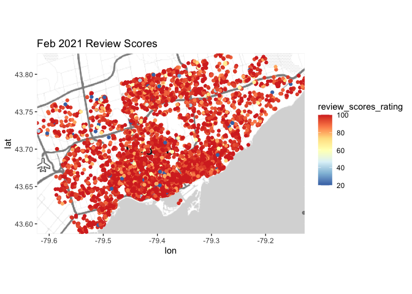
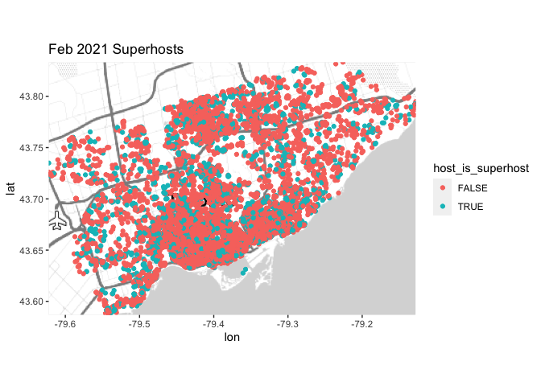
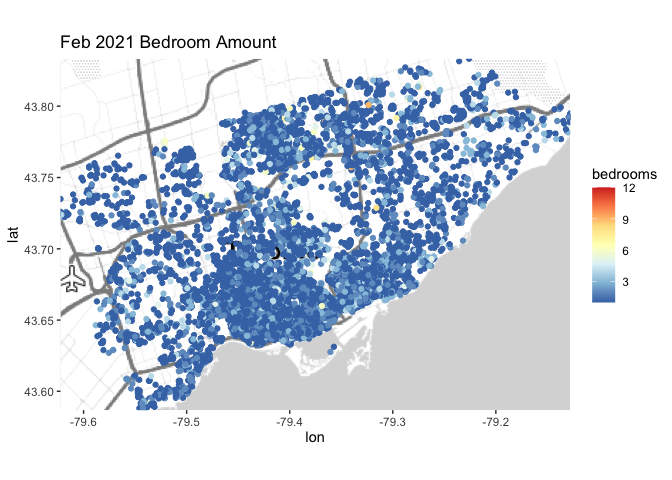
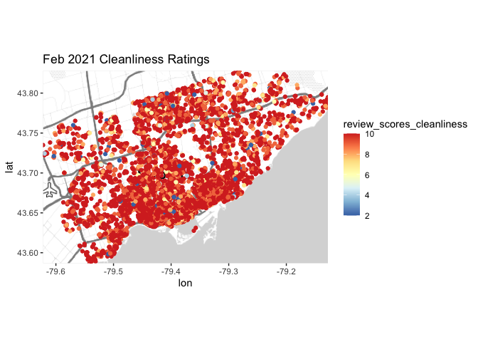

More Data Exploration
================
Henry Shiffer

# Continued Data Exploration and Initial Modelling:

``` r
library(tidyverse) 
library(tidymodels) 
library(ggmap)
library(varhandle)
library(caret)
library(readr)
```

In this section will continue exploring Toronto’s February 2021 Airbnb
data and build some initial models.

Loading Toronto’s February 2021 Airbnb data into R by:

``` r
feb_21_airbnb <- read_csv("AirbnbFebruary2021.csv", guess_max = 20000)
glimpse(feb_21_airbnb)
```

    ## Rows: 15,832
    ## Columns: 74
    ## $ id                                           <dbl> 1419, 8077, 23691, 27423,…
    ## $ listing_url                                  <chr> "https://www.airbnb.com/r…
    ## $ scrape_id                                    <dbl> 2.021021e+13, 2.021021e+1…
    ## $ last_scraped                                 <date> 2021-02-09, 2021-02-09, …
    ## $ name                                         <chr> "Beautiful home in amazin…
    ## $ description                                  <chr> "This large, family home …
    ## $ neighborhood_overview                        <chr> "The apartment is located…
    ## $ picture_url                                  <chr> "https://a0.muscache.com/…
    ## $ host_id                                      <dbl> 1565, 22795, 93825, 11812…
    ## $ host_url                                     <chr> "https://www.airbnb.com/u…
    ## $ host_name                                    <chr> "Alexandra", "Kathie & La…
    ## $ host_since                                   <date> 2008-08-08, 2009-06-22, …
    ## $ host_location                                <chr> "Vancouver, British Colum…
    ## $ host_about                                   <chr> "I live in Vancouver, Can…
    ## $ host_response_time                           <chr> "N/A", "N/A", "N/A", "N/A…
    ## $ host_response_rate                           <chr> "N/A", "N/A", "N/A", "N/A…
    ## $ host_acceptance_rate                         <chr> "N/A", "N/A", "N/A", "N/A…
    ## $ host_is_superhost                            <lgl> FALSE, FALSE, FALSE, FALS…
    ## $ host_thumbnail_url                           <chr> "https://a0.muscache.com/…
    ## $ host_picture_url                             <chr> "https://a0.muscache.com/…
    ## $ host_neighbourhood                           <chr> "Commercial Drive", "Harb…
    ## $ host_listings_count                          <dbl> 1, 2, 2, 1, 2, 3, 2, 13, …
    ## $ host_total_listings_count                    <dbl> 1, 2, 2, 1, 2, 3, 2, 13, …
    ## $ host_verifications                           <chr> "['email', 'phone', 'revi…
    ## $ host_has_profile_pic                         <lgl> TRUE, TRUE, TRUE, TRUE, T…
    ## $ host_identity_verified                       <lgl> TRUE, FALSE, TRUE, TRUE, …
    ## $ neighbourhood                                <chr> "Toronto, Ontario, Canada…
    ## $ neighbourhood_cleansed                       <chr> "Little Portugal", "Water…
    ## $ neighbourhood_group_cleansed                 <lgl> NA, NA, NA, NA, NA, NA, N…
    ## $ latitude                                     <dbl> 43.64617, 43.64105, 43.69…
    ## $ longitude                                    <dbl> -79.42451, -79.37628, -79…
    ## $ property_type                                <chr> "Entire house", "Private …
    ## $ room_type                                    <chr> "Entire home/apt", "Priva…
    ## $ accommodates                                 <dbl> 10, 2, 3, 1, 2, 5, 2, 4, …
    ## $ bathrooms                                    <lgl> NA, NA, NA, NA, NA, NA, N…
    ## $ bathrooms_text                               <chr> "3 baths", "1.5 baths", "…
    ## $ bedrooms                                     <dbl> 5, 1, 1, NA, 1, 2, NA, 3,…
    ## $ beds                                         <dbl> 7, 1, 1, 1, 2, 2, 1, 3, 2…
    ## $ amenities                                    <chr> "[\"TV\", \"Washer\", \"H…
    ## $ price                                        <chr> "$469.00", "$96.00", "$72…
    ## $ minimum_nights                               <dbl> 28, 180, 28, 365, 180, 30…
    ## $ maximum_nights                               <dbl> 730, 365, 28, 365, 365, 3…
    ## $ minimum_minimum_nights                       <dbl> 28, 180, 28, 365, 180, 30…
    ## $ maximum_minimum_nights                       <dbl> 28, 180, 28, 365, 180, 30…
    ## $ minimum_maximum_nights                       <dbl> 730, 365, 28, 365, 365, 1…
    ## $ maximum_maximum_nights                       <dbl> 730, 365, 28, 365, 365, 1…
    ## $ minimum_nights_avg_ntm                       <dbl> 28, 180, 28, 365, 180, 30…
    ## $ maximum_nights_avg_ntm                       <dbl> 730, 365, 28, 365, 365, 1…
    ## $ calendar_updated                             <lgl> NA, NA, NA, NA, NA, NA, N…
    ## $ has_availability                             <lgl> TRUE, TRUE, TRUE, TRUE, T…
    ## $ availability_30                              <dbl> 0, 30, 28, 11, 30, 11, 23…
    ## $ availability_60                              <dbl> 0, 60, 58, 41, 60, 41, 53…
    ## $ availability_90                              <dbl> 0, 90, 88, 71, 90, 71, 83…
    ## $ availability_365                             <dbl> 0, 365, 362, 346, 365, 34…
    ## $ calendar_last_scraped                        <date> 2021-02-09, 2021-02-09, …
    ## $ number_of_reviews                            <dbl> 7, 169, 217, 26, 1, 111, …
    ## $ number_of_reviews_ltm                        <dbl> 0, 0, 0, 0, 0, 2, 2, 0, 1…
    ## $ number_of_reviews_l30d                       <dbl> 0, 0, 0, 0, 0, 0, 1, 0, 0…
    ## $ first_review                                 <date> 2015-07-19, 2009-08-20, …
    ## $ last_review                                  <date> 2017-12-04, 2013-08-27, …
    ## $ review_scores_rating                         <dbl> 100, 97, 95, 98, 100, 92,…
    ## $ review_scores_accuracy                       <dbl> 10, 10, 10, 10, NA, 9, 10…
    ## $ review_scores_cleanliness                    <dbl> 10, 10, 10, 10, NA, 9, 9,…
    ## $ review_scores_checkin                        <dbl> 10, 10, 10, 10, NA, 10, 1…
    ## $ review_scores_communication                  <dbl> 10, 10, 10, 10, NA, 10, 1…
    ## $ review_scores_location                       <dbl> 10, 10, 9, 10, NA, 9, 9, …
    ## $ review_scores_value                          <dbl> 10, 10, 10, 10, NA, 9, 10…
    ## $ license                                      <chr> NA, NA, NA, NA, NA, NA, N…
    ## $ instant_bookable                             <lgl> FALSE, TRUE, TRUE, FALSE,…
    ## $ calculated_host_listings_count               <dbl> 1, 2, 2, 1, 2, 4, 2, 13, …
    ## $ calculated_host_listings_count_entire_homes  <dbl> 1, 1, 0, 1, 1, 4, 2, 13, …
    ## $ calculated_host_listings_count_private_rooms <dbl> 0, 1, 2, 0, 1, 0, 0, 0, 1…
    ## $ calculated_host_listings_count_shared_rooms  <dbl> 0, 0, 0, 0, 0, 0, 0, 0, 0…
    ## $ reviews_per_month                            <dbl> 0.10, 1.21, 1.66, 0.20, 0…

``` r
#getting rid of the $ and , in price
feb_21_airbnb <- feb_21_airbnb %>% 
  mutate(price = str_remove(price, "\\$"),
         price = str_remove(price, ","),
         price = as.integer(price)
         )
```

A note: The Airbnb data is being called locally and is not on Github.

## Review Scores Map:

We can gain a view of where in Toronto has the highest and lowest Airbnb
review score ratings. To do this the NA values must be filtered out
before these values can be mapped.

``` r
#getting rid of NA values for review_scores_rating in the original data-set
rsr_filtered_airbnb <- feb_21_airbnb %>%
  filter(!is.na(review_scores_rating))

#mapping the NA value filtered review_scores_ratings values
rsr_filtered_borders <- c(bottom  = min(rsr_filtered_airbnb$latitude), 
                top = max(rsr_filtered_airbnb$latitude),
                left = min(rsr_filtered_airbnb$longitude),
                right = max(rsr_filtered_airbnb$longitude))
map1 <- get_stamenmap(rsr_filtered_borders, maptype = "toner-lite")
```

    ## Source : http://tile.stamen.com/toner-lite/10/285/373.png

    ## Source : http://tile.stamen.com/toner-lite/10/286/373.png

``` r
ggmap(map1) + geom_point(data = rsr_filtered_airbnb, mapping = aes(x = longitude, y = latitude, 
                                               col = review_scores_rating)) + scale_colour_distiller(palette = "RdYlBu") + ggtitle("Feb 2021 Review Scores")
```

<!-- -->

## Superhosts Map:

A map of superhosts would also be interesting. From the Airbnb website
(<https://www.airbnb.ca/help/article/829/how-do-i-become-a-superhost>),
a superhost is defined as a host who has met all of the following
requirements:

> “Completed at least 10 trips OR completed 3 reservations that total at
> least 100 nights”

> “Maintained a 90% response rate or higher”

> “Maintained a 1% percent cancellation rate (1 cancellation per 100
> reservations)”

> “Maintained a 4.8 overall rating (this rating looks at the past 365
> days of reviews, based on the date the guest left a review, not the
> date the guest checked out)”

If these listings have hosts that are superhosts, the listings have a
better chance of being better maintained and of higher quality to stay
in.

``` r
#getting rid of NA values for host_is_superhost in the original data-set
super_filtered_airbnb <- feb_21_airbnb %>%
  filter(!is.na(host_is_superhost))

#mapping the NA value filtered host_is_superhost values
super_filtered_borders <- c(bottom  = min(super_filtered_airbnb$latitude), 
                top = max(super_filtered_airbnb$latitude),
                left = min(super_filtered_airbnb$longitude),
                right = max(super_filtered_airbnb$longitude))
map2 <- get_stamenmap(super_filtered_borders, maptype = "toner-lite")
ggmap(map2) + geom_point(data = super_filtered_airbnb, mapping = aes(x = longitude, y = latitude, 
                                               col = host_is_superhost)) + ggtitle("Feb 2021 Superhosts")
```

<!-- -->

We can see that there does exists a good amount of superhost listings,
but ultimately it looks like there is more hosts that do not have
superhost status.

## Bedrooms Map:

To also get a sense of listing quality, we can plot bedroom amount on
the map.

``` r
#getting rid of NA values for host_is_superhost in the original data-set
bedrooms_filtered_airbnb <- feb_21_airbnb %>%
  filter(!is.na(bedrooms))

#mapping the NA value filtered host_is_superhost values
bedrooms_filtered_borders <- c(bottom  = min(bedrooms_filtered_airbnb$latitude), 
                top = max(bedrooms_filtered_airbnb$latitude),
                left = min(bedrooms_filtered_airbnb$longitude),
                right = max(bedrooms_filtered_airbnb$longitude))
map3 <- get_stamenmap(bedrooms_filtered_borders, maptype = "toner-lite")
ggmap(map3) + geom_point(data = bedrooms_filtered_airbnb, mapping = aes(x = longitude, y = latitude, 
                                               col = bedrooms)) + scale_colour_distiller(palette = "RdYlBu") + ggtitle("Feb 2021 Bedroom Amount")
```

<!-- -->

We can see an overwhelming amount of listings have less than \~5
bedrooms. This makes sense. Bedroom space is very hard to come by in the
city, and these listings reflect that.

## Cleanliness Map:

Regardless of the pandemic, cleanliness is a good indicator of Airbnb
listing quality. If a listing has received low review scores for
cleanliness, it is unlikely anyone will feel comfortable living in that
property.

We can gain a view of Toronto Airbnb listing cleanliness on a map of the
city.

``` r
#getting rid of NA values for review_scores_cleanliness in the original data-set
clean_filtered_airbnb <- feb_21_airbnb %>%
  filter(!is.na(review_scores_cleanliness))

#mapping the NA value filtered out review_scores_cleanliness values
clean_filtered_borders <- c(bottom  = min(clean_filtered_airbnb$latitude), 
                top = max(clean_filtered_airbnb$latitude),
                left = min(clean_filtered_airbnb$longitude),
                right = max(clean_filtered_airbnb$longitude))
map4 <- get_stamenmap(clean_filtered_borders, maptype = "toner-lite")
ggmap(map4) + geom_point(data = clean_filtered_airbnb, mapping = aes(x = longitude, y = latitude, 
                                               col = review_scores_cleanliness)) + scale_colour_distiller(palette = "RdYlBu") + ggtitle("Feb 2021 Cleanliness Ratings")
```

<!-- -->

We can see there is definitely many listings that have review scores for
cleanliness that are 6 and below. These listings are likely not very
well maintained and are possibly used just as a short-term rental
property without a host living there.

I would not recommend any listings that are below a cleanliness rating
of 6 to anyone, especially during a pandemic.

## Initial Linear Modelling of Feburary 2021 Airbnb data:

We can start fitting simple linear models with the variables we are
interested in.

### Cleaning variables before modelling:

We can see that bathroom amount is categorized as a string. For analysis
of bathroom amount, it would make sense to extract the numeric value in
the string.

``` r
glimpse(feb_21_airbnb$bathrooms_text)
```

    ##  chr [1:15832] "3 baths" "1.5 baths" "1 shared bath" "1 bath" "1.5 baths" ...

``` r
#parse_number() drops any non-numeric characters
feb_21_airbnb$bathrooms_numeric <- parse_number(feb_21_airbnb$bathrooms_text)
```

We must also make sure that price is an integer and not a character.

``` r
#stripping away $ and , from price
feb_21_airbnb <- feb_21_airbnb %>% 
  mutate(price = str_remove(price, "\\$"),
         price = str_remove(price, ","),
         price = as.integer(price)
         )

#removing NAs from price
feb_21_airbnb <- feb_21_airbnb %>%
  filter(!is.na(price))
```

### Test set and train set:

We can now split the data into a test set and training set to test the
accuracy of our model in prediction later on.

``` r
set.seed(496)

#splitting the data
feb_21_airbnb_split <- 
  feb_21_airbnb %>%
  initial_split(prop = 3/4)

#creating the test and train set
feb_21_airbnb_train <- training(feb_21_airbnb_split)
feb_21_airbnb_test <- testing(feb_21_airbnb_split)
```

### Modelling price with bedrooms:

``` r
#removing NAs from bedrooms
feb_21_airbnb_train <- feb_21_airbnb_train %>%
  filter(!is.na(bedrooms))

#price ~ bedrooms model
price_and_bedrooms <- lm(price ~ bedrooms, data = feb_21_airbnb_train)
summary(price_and_bedrooms)
```

    ## 
    ## Call:
    ## lm(formula = price ~ bedrooms, data = feb_21_airbnb_train)
    ## 
    ## Residuals:
    ##     Min      1Q  Median      3Q     Max 
    ##  -883.6   -63.3   -31.8    11.2 12896.7 
    ## 
    ## Coefficients:
    ##             Estimate Std. Error t value Pr(>|t|)    
    ## (Intercept)   18.841      6.077    3.10  0.00194 ** 
    ## bedrooms      84.477      3.684   22.93  < 2e-16 ***
    ## ---
    ## Signif. codes:  0 '***' 0.001 '**' 0.01 '*' 0.05 '.' 0.1 ' ' 1
    ## 
    ## Residual standard error: 315.1 on 10988 degrees of freedom
    ## Multiple R-squared:  0.04566,    Adjusted R-squared:  0.04557 
    ## F-statistic: 525.7 on 1 and 10988 DF,  p-value: < 2.2e-16

We can see that the p-value for the bedrooms covariate is &lt; 2e-16
when that variable is the only predictor.

### Modelling price with bathrooms:

``` r
#removing any possible NAs still in bathrooms_numeric 
feb_21_airbnb_train <- feb_21_airbnb_train %>%
  filter(!is.na(bathrooms_numeric))

#price ~ bathrooms model
price_and_bathrooms <- lm(price ~ bathrooms_numeric, data = feb_21_airbnb_train)
summary(price_and_bathrooms)
```

    ## 
    ## Call:
    ## lm(formula = price ~ bathrooms_numeric, data = feb_21_airbnb_train)
    ## 
    ## Residuals:
    ##    Min     1Q Median     3Q    Max 
    ##  -1084    -64    -31     14  12889 
    ## 
    ## Coefficients:
    ##                   Estimate Std. Error t value Pr(>|t|)    
    ## (Intercept)          8.943      7.324   1.221    0.222    
    ## bathrooms_numeric  102.029      5.202  19.613   <2e-16 ***
    ## ---
    ## Signif. codes:  0 '***' 0.001 '**' 0.01 '*' 0.05 '.' 0.1 ' ' 1
    ## 
    ## Residual standard error: 316.6 on 10958 degrees of freedom
    ## Multiple R-squared:  0.03391,    Adjusted R-squared:  0.03383 
    ## F-statistic: 384.7 on 1 and 10958 DF,  p-value: < 2.2e-16

We can see that the p-value for the bathrooms covariate is &lt; 2e-16
when that variable is the only predictor.

### Modelling price with neighbourhood:

``` r
#removing any possible NAs in neighbourhood_cleansed
feb_21_airbnb_train <- feb_21_airbnb_train %>%
  filter(!is.na(neighbourhood_cleansed))

#price ~ neighbourhood model
price_and_neighbourhood <- lm(price ~ neighbourhood_cleansed, data = feb_21_airbnb_train)
summary(price_and_neighbourhood)
```

    ## 
    ## Call:
    ## lm(formula = price ~ neighbourhood_cleansed, data = feb_21_airbnb_train)
    ## 
    ## Residuals:
    ##     Min      1Q  Median      3Q     Max 
    ##  -661.0   -71.3   -34.3     8.4 12804.0 
    ## 
    ## Coefficients:
    ##                                                             Estimate Std. Error
    ## (Intercept)                                                91.235294  77.663554
    ## neighbourhood_cleansedAgincourt South-Malvern West        -33.602941  86.830493
    ## neighbourhood_cleansedAlderwood                            -5.335294 105.633854
    ## neighbourhood_cleansedAnnex                               117.470227  79.662791
    ## neighbourhood_cleansedBanbury-Don Mills                    26.223039 101.508770
    ## neighbourhood_cleansedBathurst Manor                      134.764706  97.208795
    ## neighbourhood_cleansedBay Street Corridor                  57.412732  79.805530
    ## neighbourhood_cleansedBayview Village                      26.598039  87.980616
    ## neighbourhood_cleansedBayview Woods-Steeles               102.314706  92.709597
    ## neighbourhood_cleansedBedford Park-Nortown                 14.064706  89.902063
    ## neighbourhood_cleansedBeechborough-Greenbrook              34.764706 127.614241
    ## neighbourhood_cleansedBendale                              12.359300  93.823856
    ## neighbourhood_cleansedBirchcliffe-Cliffside                -3.701961  91.160531
    ## neighbourhood_cleansedBlack Creek                         -41.797794 111.535787
    ## neighbourhood_cleansedBlake-Jones                          14.396285  93.434401
    ## neighbourhood_cleansedBriar Hill-Belgravia                -31.127186  93.823856
    ## neighbourhood_cleansedBridle Path-Sunnybrook-York Mills   108.647059 109.832851
    ## neighbourhood_cleansedBroadview North                      81.069054 102.419662
    ## neighbourhood_cleansedBrookhaven-Amesbury                 -26.335294 127.614241
    ## neighbourhood_cleansedCabbagetown-South St.James Town      75.747315  83.206126
    ## neighbourhood_cleansedCaledonia-Fairbank                  -41.083779  95.597226
    ## neighbourhood_cleansedCasa Loma                           103.440382  93.823856
    ## neighbourhood_cleansedCentennial Scarborough               21.064706 127.614241
    ## neighbourhood_cleansedChurch-Yonge Corridor                41.498259  79.805530
    ## neighbourhood_cleansedClairlea-Birchmount                   0.787433  91.444131
    ## neighbourhood_cleansedClanton Park                        -26.952685  90.888433
    ## neighbourhood_cleansedCliffcrest                           13.098039 104.471880
    ## neighbourhood_cleansedCorso Italia-Davenport              -20.220588  86.830493
    ## neighbourhood_cleansedDanforth                             26.253078  91.739983
    ## neighbourhood_cleansedDanforth East York                   52.521463  93.823856
    ## neighbourhood_cleansedDon Valley Village                   13.025575  86.704560
    ## neighbourhood_cleansedDorset Park                         -17.630031  93.434401
    ## neighbourhood_cleansedDovercourt-Wallace Emerson-Junction   9.195536  80.230386
    ## neighbourhood_cleansedDownsview-Roding-CFB                -13.647059  95.118039
    ## neighbourhood_cleansedDufferin Grove                       22.960784  83.886226
    ## neighbourhood_cleansedEast End-Danforth                    16.297173  85.809589
    ## neighbourhood_cleansedEdenbridge-Humber Valley             97.514706 120.732901
    ## neighbourhood_cleansedEglinton East                       -32.409207 102.419662
    ## neighbourhood_cleansedElms-Old Rexdale                     -4.568627 132.002659
    ## neighbourhood_cleansedEnglemount-Lawrence                  14.550420  98.456524
    ## neighbourhood_cleansedEringate-Centennial-West Deane       14.635674  96.640024
    ## neighbourhood_cleansedEtobicoke West Mall                  55.448916 106.903447
    ## neighbourhood_cleansedFlemingdon Park                       0.264706 111.535787
    ## neighbourhood_cleansedForest Hill North                   -10.568627 113.434881
    ## neighbourhood_cleansedForest Hill South                   146.882353 109.832851
    ## neighbourhood_cleansedGlenfield-Jane Heights              -38.672794 111.535787
    ## neighbourhood_cleansedGreenwood-Coxwell                    31.349121  85.809589
    ## neighbourhood_cleansedGuildwood                           -17.860294 137.291064
    ## neighbourhood_cleansedHenry Farm                           88.764706 100.663471
    ## neighbourhood_cleansedHigh Park North                      27.435160  84.834123
    ## neighbourhood_cleansedHigh Park-Swansea                    48.246849  83.349520
    ## neighbourhood_cleansedHighland Creek                       -5.485294  96.103745
    ## neighbourhood_cleansedHillcrest Village                   -17.235294  91.160531
    ## neighbourhood_cleansedHumber Heights-Westmount            -12.457516 132.002659
    ## neighbourhood_cleansedHumber Summit                       -21.508021 123.908167
    ## neighbourhood_cleansedHumbermede                          -20.326203 123.908167
    ## neighbourhood_cleansedHumewood-Cedarvale                   39.653595  89.053205
    ## neighbourhood_cleansedIonview                             -22.041746  96.640024
    ## neighbourhood_cleansedIslington-City Centre West           -0.605664  83.552681
    ## neighbourhood_cleansedJunction Area                         9.853313  85.612924
    ## neighbourhood_cleansedKeelesdale-Eglinton West            -25.140056 104.471880
    ## neighbourhood_cleansedKennedy Park                         -4.161220  99.142922
    ## neighbourhood_cleansedKensington-Chinatown                 27.926611  79.731700
    ## neighbourhood_cleansedKingsview Village-The Westway         9.117647 109.832851
    ## neighbourhood_cleansedKingsway South                      121.098039 152.056697
    ## neighbourhood_cleansedL'Amoreaux                          -22.087753  87.821256
    ## neighbourhood_cleansedLambton Baby Point                   46.336134 115.567066
    ## neighbourhood_cleansedLansing-Westgate                      6.073348  85.425551
    ## neighbourhood_cleansedLawrence Park North                  85.450420  94.664012
    ## neighbourhood_cleansedLawrence Park South                  76.420956  96.103745
    ## neighbourhood_cleansedLeaside-Bennington                  102.170956  96.103745
    ## neighbourhood_cleansedLittle Portugal                      51.931373  80.745911
    ## neighbourhood_cleansedLong Branch                          30.952206  96.103745
    ## neighbourhood_cleansedMalvern                             -42.016116  86.233713
    ## neighbourhood_cleansedMaple Leaf                           21.514706 120.732901
    ## neighbourhood_cleansedMarkland Wood                        88.431373 132.002659
    ## neighbourhood_cleansedMilliken                             -3.651961 120.732901
    ## neighbourhood_cleansedMimico (includes Humber Bay Shores)  39.379521  82.408530
    ## neighbourhood_cleansedMorningside                          -2.901961 108.296652
    ## neighbourhood_cleansedMoss Park                            60.507897  80.191065
    ## neighbourhood_cleansedMount Dennis                         -6.705882 109.832851
    ## neighbourhood_cleansedMount Olive-Silverstone-Jamestown   -23.306723 115.567066
    ## neighbourhood_cleansedMount Pleasant East                  47.615770  90.627149
    ## neighbourhood_cleansedMount Pleasant West                  18.642568  82.549124
    ## neighbourhood_cleansedNew Toronto                          35.564706  94.664012
    ## neighbourhood_cleansedNewtonbrook East                      0.003342  84.834123
    ## neighbourhood_cleansedNewtonbrook West                    104.789499  82.940016
    ## neighbourhood_cleansedNiagara                              89.865855  79.166573
    ## neighbourhood_cleansedNorth Riverdale                      54.080495  88.490305
    ## neighbourhood_cleansedNorth St.James Town                  17.339174  84.394632
    ## neighbourhood_cleansedO'Connor-Parkview                   -19.337858  93.063412
    ## neighbourhood_cleansedOakridge                             14.419878  97.813134
    ## neighbourhood_cleansedOakwood Village                      -1.327399  85.911626
    ## neighbourhood_cleansedOld East York                        -9.701961  97.208795
    ## neighbourhood_cleansedPalmerston-Little Italy              41.989305  81.116936
    ## neighbourhood_cleansedParkwoods-Donalda                    -8.147575  88.490305
    ## neighbourhood_cleansedPelmo Park-Humberlea                 25.173797 103.404210
    ## neighbourhood_cleansedPlayter Estates-Danforth             30.119545  96.640024
    ## neighbourhood_cleansedPleasant View                       -32.511156  88.314882
    ## neighbourhood_cleansedPrincess-Rosethorn                    8.264706 108.296652
    ## neighbourhood_cleansedRegent Park                          63.389706  88.671627
    ## neighbourhood_cleansedRexdale-Kipling                     -17.385294 105.633854
    ## neighbourhood_cleansedRockcliffe-Smythe                    19.693277  98.456524
    ## neighbourhood_cleansedRoncesvalles                         49.255934  83.253113
    ## neighbourhood_cleansedRosedale-Moore Park                 121.525900  86.959994
    ## neighbourhood_cleansedRouge                                 1.310160 103.404210
    ## neighbourhood_cleansedRunnymede-Bloor West Village         27.414706 105.633854
    ## neighbourhood_cleansedRustic                              599.764706 200.526433
    ## neighbourhood_cleansedScarborough Village                   9.407563 115.567066
    ## neighbourhood_cleansedSouth Parkdale                       12.568503  81.734938
    ## neighbourhood_cleansedSouth Riverdale                      61.440896  80.745911
    ## neighbourhood_cleansedSt.Andrew-Windfields                 91.598039  97.208795
    ## neighbourhood_cleansedSteeles                             -38.910970  93.823856
    ## neighbourhood_cleansedStonegate-Queensway                  19.320261  87.516911
    ## neighbourhood_cleansedTam O'Shanter-Sullivan              -17.485294  90.376042
    ## neighbourhood_cleansedTaylor-Massey                         3.264706  98.456524
    ## neighbourhood_cleansedThe Beaches                          60.886928  84.681373
    ## neighbourhood_cleansedThistletown-Beaumond Heights         18.264706 152.056697
    ## neighbourhood_cleansedThorncliffe Park                    -18.445820 106.903447
    ## neighbourhood_cleansedTrinity-Bellwoods                    40.464340  80.045134
    ## neighbourhood_cleansedUniversity                           44.219930  82.442914
    ## neighbourhood_cleansedVictoria Village                     -2.187675 104.471880
    ## neighbourhood_cleansedWaterfront Communities-The Island   110.094354  77.994577
    ## neighbourhood_cleansedWest Hill                           -27.332068  96.640024
    ## neighbourhood_cleansedWest Humber-Clairville              -26.735294  87.371498
    ## neighbourhood_cleansedWestminster-Branson                 -21.945820  93.434401
    ## neighbourhood_cleansedWeston                               34.176471  95.118039
    ## neighbourhood_cleansedWeston-Pellam Park                   -7.025992  91.739983
    ## neighbourhood_cleansedWexford/Maryvale                     -2.703036  87.666761
    ## neighbourhood_cleansedWillowdale East                      17.113240  79.784876
    ## neighbourhood_cleansedWillowdale West                      15.089706  85.518118
    ## neighbourhood_cleansedWillowridge-Martingrove-Richview     -5.998452  93.434401
    ## neighbourhood_cleansedWoburn                              326.039706  92.709597
    ## neighbourhood_cleansedWoodbine Corridor                    47.984706  89.902063
    ## neighbourhood_cleansedWoodbine-Lumsden                     23.673797 103.404210
    ## neighbourhood_cleansedWychwood                             21.538899  87.666761
    ## neighbourhood_cleansedYonge-Eglinton                       42.744298  90.134528
    ## neighbourhood_cleansedYonge-St.Clair                       88.250420  94.664012
    ## neighbourhood_cleansedYork University Heights             -35.483157  83.114487
    ## neighbourhood_cleansedYorkdale-Glen Park                   13.696213  86.233713
    ##                                                           t value Pr(>|t|)    
    ## (Intercept)                                                 1.175 0.240120    
    ## neighbourhood_cleansedAgincourt South-Malvern West         -0.387 0.698768    
    ## neighbourhood_cleansedAlderwood                            -0.051 0.959719    
    ## neighbourhood_cleansedAnnex                                 1.475 0.140351    
    ## neighbourhood_cleansedBanbury-Don Mills                     0.258 0.796155    
    ## neighbourhood_cleansedBathurst Manor                        1.386 0.165671    
    ## neighbourhood_cleansedBay Street Corridor                   0.719 0.471905    
    ## neighbourhood_cleansedBayview Village                       0.302 0.762416    
    ## neighbourhood_cleansedBayview Woods-Steeles                 1.104 0.269789    
    ## neighbourhood_cleansedBedford Park-Nortown                  0.156 0.875685    
    ## neighbourhood_cleansedBeechborough-Greenbrook               0.272 0.785304    
    ## neighbourhood_cleansedBendale                               0.132 0.895201    
    ## neighbourhood_cleansedBirchcliffe-Cliffside                -0.041 0.967608    
    ## neighbourhood_cleansedBlack Creek                          -0.375 0.707855    
    ## neighbourhood_cleansedBlake-Jones                           0.154 0.877550    
    ## neighbourhood_cleansedBriar Hill-Belgravia                 -0.332 0.740075    
    ## neighbourhood_cleansedBridle Path-Sunnybrook-York Mills     0.989 0.322586    
    ## neighbourhood_cleansedBroadview North                       0.792 0.428647    
    ## neighbourhood_cleansedBrookhaven-Amesbury                  -0.206 0.836509    
    ## neighbourhood_cleansedCabbagetown-South St.James Town       0.910 0.362654    
    ## neighbourhood_cleansedCaledonia-Fairbank                   -0.430 0.667379    
    ## neighbourhood_cleansedCasa Loma                             1.102 0.270271    
    ## neighbourhood_cleansedCentennial Scarborough                0.165 0.868896    
    ## neighbourhood_cleansedChurch-Yonge Corridor                 0.520 0.603080    
    ## neighbourhood_cleansedClairlea-Birchmount                   0.009 0.993130    
    ## neighbourhood_cleansedClanton Park                         -0.297 0.766818    
    ## neighbourhood_cleansedCliffcrest                            0.125 0.900230    
    ## neighbourhood_cleansedCorso Italia-Davenport               -0.233 0.815863    
    ## neighbourhood_cleansedDanforth                              0.286 0.774755    
    ## neighbourhood_cleansedDanforth East York                    0.560 0.575636    
    ## neighbourhood_cleansedDon Valley Village                    0.150 0.880586    
    ## neighbourhood_cleansedDorset Park                          -0.189 0.850340    
    ## neighbourhood_cleansedDovercourt-Wallace Emerson-Junction   0.115 0.908753    
    ## neighbourhood_cleansedDownsview-Roding-CFB                 -0.143 0.885918    
    ## neighbourhood_cleansedDufferin Grove                        0.274 0.784310    
    ## neighbourhood_cleansedEast End-Danforth                     0.190 0.849373    
    ## neighbourhood_cleansedEdenbridge-Humber Valley              0.808 0.419287    
    ## neighbourhood_cleansedEglinton East                        -0.316 0.751678    
    ## neighbourhood_cleansedElms-Old Rexdale                     -0.035 0.972391    
    ## neighbourhood_cleansedEnglemount-Lawrence                   0.148 0.882515    
    ## neighbourhood_cleansedEringate-Centennial-West Deane        0.151 0.879627    
    ## neighbourhood_cleansedEtobicoke West Mall                   0.519 0.603993    
    ## neighbourhood_cleansedFlemingdon Park                       0.002 0.998106    
    ## neighbourhood_cleansedForest Hill North                    -0.093 0.925771    
    ## neighbourhood_cleansedForest Hill South                     1.337 0.181144    
    ## neighbourhood_cleansedGlenfield-Jane Heights               -0.347 0.728801    
    ## neighbourhood_cleansedGreenwood-Coxwell                     0.365 0.714870    
    ## neighbourhood_cleansedGuildwood                            -0.130 0.896497    
    ## neighbourhood_cleansedHenry Farm                            0.882 0.377906    
    ## neighbourhood_cleansedHigh Park North                       0.323 0.746400    
    ## neighbourhood_cleansedHigh Park-Swansea                     0.579 0.562703    
    ## neighbourhood_cleansedHighland Creek                       -0.057 0.954485    
    ## neighbourhood_cleansedHillcrest Village                    -0.189 0.850045    
    ## neighbourhood_cleansedHumber Heights-Westmount             -0.094 0.924814    
    ## neighbourhood_cleansedHumber Summit                        -0.174 0.862199    
    ## neighbourhood_cleansedHumbermede                           -0.164 0.869701    
    ## neighbourhood_cleansedHumewood-Cedarvale                    0.445 0.656126    
    ## neighbourhood_cleansedIonview                              -0.228 0.819588    
    ## neighbourhood_cleansedIslington-City Centre West           -0.007 0.994216    
    ## neighbourhood_cleansedJunction Area                         0.115 0.908375    
    ## neighbourhood_cleansedKeelesdale-Eglinton West             -0.241 0.809839    
    ## neighbourhood_cleansedKennedy Park                         -0.042 0.966522    
    ## neighbourhood_cleansedKensington-Chinatown                  0.350 0.726152    
    ## neighbourhood_cleansedKingsview Village-The Westway         0.083 0.933842    
    ## neighbourhood_cleansedKingsway South                        0.796 0.425817    
    ## neighbourhood_cleansedL'Amoreaux                           -0.252 0.801426    
    ## neighbourhood_cleansedLambton Baby Point                    0.401 0.688468    
    ## neighbourhood_cleansedLansing-Westgate                      0.071 0.943323    
    ## neighbourhood_cleansedLawrence Park North                   0.903 0.366721    
    ## neighbourhood_cleansedLawrence Park South                   0.795 0.426519    
    ## neighbourhood_cleansedLeaside-Bennington                    1.063 0.287746    
    ## neighbourhood_cleansedLittle Portugal                       0.643 0.520143    
    ## neighbourhood_cleansedLong Branch                           0.322 0.747405    
    ## neighbourhood_cleansedMalvern                              -0.487 0.626101    
    ## neighbourhood_cleansedMaple Leaf                            0.178 0.858569    
    ## neighbourhood_cleansedMarkland Wood                         0.670 0.502922    
    ## neighbourhood_cleansedMilliken                             -0.030 0.975870    
    ## neighbourhood_cleansedMimico (includes Humber Bay Shores)   0.478 0.632761    
    ## neighbourhood_cleansedMorningside                          -0.027 0.978623    
    ## neighbourhood_cleansedMoss Park                             0.755 0.450537    
    ## neighbourhood_cleansedMount Dennis                         -0.061 0.951316    
    ## neighbourhood_cleansedMount Olive-Silverstone-Jamestown    -0.202 0.840176    
    ## neighbourhood_cleansedMount Pleasant East                   0.525 0.599314    
    ## neighbourhood_cleansedMount Pleasant West                   0.226 0.821333    
    ## neighbourhood_cleansedNew Toronto                           0.376 0.707152    
    ## neighbourhood_cleansedNewtonbrook East                      0.000 0.999969    
    ## neighbourhood_cleansedNewtonbrook West                      1.263 0.206459    
    ## neighbourhood_cleansedNiagara                               1.135 0.256338    
    ## neighbourhood_cleansedNorth Riverdale                       0.611 0.541116    
    ## neighbourhood_cleansedNorth St.James Town                   0.205 0.837222    
    ## neighbourhood_cleansedO'Connor-Parkview                    -0.208 0.835395    
    ## neighbourhood_cleansedOakridge                              0.147 0.882801    
    ## neighbourhood_cleansedOakwood Village                      -0.015 0.987673    
    ## neighbourhood_cleansedOld East York                        -0.100 0.920501    
    ## neighbourhood_cleansedPalmerston-Little Italy               0.518 0.604721    
    ## neighbourhood_cleansedParkwoods-Donalda                    -0.092 0.926642    
    ## neighbourhood_cleansedPelmo Park-Humberlea                  0.243 0.807661    
    ## neighbourhood_cleansedPlayter Estates-Danforth              0.312 0.755299    
    ## neighbourhood_cleansedPleasant View                        -0.368 0.712785    
    ## neighbourhood_cleansedPrincess-Rosethorn                    0.076 0.939170    
    ## neighbourhood_cleansedRegent Park                           0.715 0.474698    
    ## neighbourhood_cleansedRexdale-Kipling                      -0.165 0.869277    
    ## neighbourhood_cleansedRockcliffe-Smythe                     0.200 0.841469    
    ## neighbourhood_cleansedRoncesvalles                          0.592 0.554104    
    ## neighbourhood_cleansedRosedale-Moore Park                   1.397 0.162294    
    ## neighbourhood_cleansedRouge                                 0.013 0.989891    
    ## neighbourhood_cleansedRunnymede-Bloor West Village          0.260 0.795235    
    ## neighbourhood_cleansedRustic                                2.991 0.002787 ** 
    ## neighbourhood_cleansedScarborough Village                   0.081 0.935123    
    ## neighbourhood_cleansedSouth Parkdale                        0.154 0.877793    
    ## neighbourhood_cleansedSouth Riverdale                       0.761 0.446724    
    ## neighbourhood_cleansedSt.Andrew-Windfields                  0.942 0.346070    
    ## neighbourhood_cleansedSteeles                              -0.415 0.678352    
    ## neighbourhood_cleansedStonegate-Queensway                   0.221 0.825283    
    ## neighbourhood_cleansedTam O'Shanter-Sullivan               -0.193 0.846592    
    ## neighbourhood_cleansedTaylor-Massey                         0.033 0.973549    
    ## neighbourhood_cleansedThe Beaches                           0.719 0.472149    
    ## neighbourhood_cleansedThistletown-Beaumond Heights          0.120 0.904392    
    ## neighbourhood_cleansedThorncliffe Park                     -0.173 0.863011    
    ## neighbourhood_cleansedTrinity-Bellwoods                     0.506 0.613205    
    ## neighbourhood_cleansedUniversity                            0.536 0.591714    
    ## neighbourhood_cleansedVictoria Village                     -0.021 0.983294    
    ## neighbourhood_cleansedWaterfront Communities-The Island     1.412 0.158107    
    ## neighbourhood_cleansedWest Hill                            -0.283 0.777318    
    ## neighbourhood_cleansedWest Humber-Clairville               -0.306 0.759614    
    ## neighbourhood_cleansedWestminster-Branson                  -0.235 0.814307    
    ## neighbourhood_cleansedWeston                                0.359 0.719373    
    ## neighbourhood_cleansedWeston-Pellam Park                   -0.077 0.938954    
    ## neighbourhood_cleansedWexford/Maryvale                     -0.031 0.975403    
    ## neighbourhood_cleansedWillowdale East                       0.214 0.830167    
    ## neighbourhood_cleansedWillowdale West                       0.176 0.859943    
    ## neighbourhood_cleansedWillowridge-Martingrove-Richview     -0.064 0.948812    
    ## neighbourhood_cleansedWoburn                                3.517 0.000439 ***
    ## neighbourhood_cleansedWoodbine Corridor                     0.534 0.593529    
    ## neighbourhood_cleansedWoodbine-Lumsden                      0.229 0.818917    
    ## neighbourhood_cleansedWychwood                              0.246 0.805926    
    ## neighbourhood_cleansedYonge-Eglinton                        0.474 0.635347    
    ## neighbourhood_cleansedYonge-St.Clair                        0.932 0.351229    
    ## neighbourhood_cleansedYork University Heights              -0.427 0.669447    
    ## neighbourhood_cleansedYorkdale-Glen Park                    0.159 0.873808    
    ## ---
    ## Signif. codes:  0 '***' 0.001 '**' 0.01 '*' 0.05 '.' 0.1 ' ' 1
    ## 
    ## Residual standard error: 320.2 on 10820 degrees of freedom
    ## Multiple R-squared:  0.02417,    Adjusted R-squared:  0.01164 
    ## F-statistic: 1.928 on 139 and 10820 DF,  p-value: 4.689e-10

We can see that all the neighbourhood levels within the
neighbourhood\_cleansed covariate have p-values that are greater than
0.05, which indicates none of these levels are significant in predicting
price when neighbourhood\_cleansed is the only predictor included in the
linear model.

### Modelling Price with cleanliness score:

``` r
#removing any possible NAs still in review_scores_cleanliness 
feb_21_airbnb_train <- feb_21_airbnb_train %>%
  filter(!is.na(review_scores_cleanliness))

#price ~ cleanliness model
price_and_cleanliness <- lm(price ~ review_scores_cleanliness, data = feb_21_airbnb_train)
summary(price_and_cleanliness)
```

    ## 
    ## Call:
    ## lm(formula = price ~ review_scores_cleanliness, data = feb_21_airbnb_train)
    ## 
    ## Residuals:
    ##     Min      1Q  Median      3Q     Max 
    ##  -118.4   -68.4   -36.4    16.5 12877.3 
    ## 
    ## Coefficients:
    ##                           Estimate Std. Error t value Pr(>|t|)    
    ## (Intercept)                102.257     24.124   4.239 2.27e-05 ***
    ## review_scores_cleanliness    2.913      2.550   1.143    0.253    
    ## ---
    ## Signif. codes:  0 '***' 0.001 '**' 0.01 '*' 0.05 '.' 0.1 ' ' 1
    ## 
    ## Residual standard error: 251.7 on 8306 degrees of freedom
    ## Multiple R-squared:  0.0001572,  Adjusted R-squared:  3.681e-05 
    ## F-statistic: 1.306 on 1 and 8306 DF,  p-value: 0.2532

We can see that the p-value for the cleanliness score covariate is
0.07707 when that variable is the only predictor.

### Modelling Price with overall review score

``` r
#removing any possible NAs in review_scores_rating 
feb_21_airbnb_train <- feb_21_airbnb_train %>%
  filter(!is.na(review_scores_rating))

#price ~ overall review score  model
price_and_reviewscore <- lm(price ~ review_scores_rating, data = feb_21_airbnb_train)
summary(price_and_reviewscore)
```

    ## 
    ## Call:
    ## lm(formula = price ~ review_scores_rating, data = feb_21_airbnb_train)
    ## 
    ## Residuals:
    ##     Min      1Q  Median      3Q     Max 
    ##  -117.6   -68.9   -35.6    16.3 12876.2 
    ## 
    ## Coefficients:
    ##                      Estimate Std. Error t value Pr(>|t|)    
    ## (Intercept)          113.6346    27.9879   4.060 4.95e-05 ***
    ## review_scores_rating   0.1698     0.2955   0.575    0.565    
    ## ---
    ## Signif. codes:  0 '***' 0.001 '**' 0.01 '*' 0.05 '.' 0.1 ' ' 1
    ## 
    ## Residual standard error: 251.7 on 8306 degrees of freedom
    ## Multiple R-squared:  3.977e-05,  Adjusted R-squared:  -8.062e-05 
    ## F-statistic: 0.3304 on 1 and 8306 DF,  p-value: 0.5655

We can see that the p-value for the overall review score covariate is
0.29881 when that variable is the only predictor.

### Modelling price with reviews per month:

``` r
#removing any possible NAs in reviews_per_month 
feb_21_airbnb_train <- feb_21_airbnb_train %>%
  filter(!is.na(reviews_per_month))

#price ~ reviews per month model
price_and_reviewspmonth <- lm(price ~ reviews_per_month, data = feb_21_airbnb_train)
summary(price_and_reviewspmonth)
```

    ## 
    ## Call:
    ## lm(formula = price ~ reviews_per_month, data = feb_21_airbnb_train)
    ## 
    ## Residuals:
    ##     Min      1Q  Median      3Q     Max 
    ##  -119.0   -68.4   -34.1    16.9 12867.1 
    ## 
    ## Coefficients:
    ##                   Estimate Std. Error t value Pr(>|t|)    
    ## (Intercept)        133.234      3.454   38.57   <2e-16 ***
    ## reviews_per_month   -3.324      1.921   -1.73   0.0836 .  
    ## ---
    ## Signif. codes:  0 '***' 0.001 '**' 0.01 '*' 0.05 '.' 0.1 ' ' 1
    ## 
    ## Residual standard error: 251.7 on 8306 degrees of freedom
    ## Multiple R-squared:  0.0003603,  Adjusted R-squared:  0.00024 
    ## F-statistic: 2.994 on 1 and 8306 DF,  p-value: 0.08362

We can see that the p-value for the reviews\_per\_month covariate is
0.219 when that variable is the only predictor.

### Modelling price with host response rate:

``` r
#removing any possible NAs in host_response_rate 
feb_21_airbnb_train <- feb_21_airbnb_train %>%
  filter(!is.na(host_response_rate))

#price ~ host response rate model
price_and_hostresp<- lm(price ~ host_response_rate, data = feb_21_airbnb_train)
summary(price_and_hostresp)
```

    ## 
    ## Call:
    ## lm(formula = price ~ host_response_rate, data = feb_21_airbnb_train)
    ## 
    ## Residuals:
    ##     Min      1Q  Median      3Q     Max 
    ##  -323.6   -67.6   -33.3    13.0 12857.7 
    ## 
    ## Coefficients:
    ##                        Estimate Std. Error t value Pr(>|t|)    
    ## (Intercept)             141.224     15.775   8.953  < 2e-16 ***
    ## host_response_rate10%   216.376     81.205   2.665  0.00772 ** 
    ## host_response_rate100%  -20.233     16.320  -1.240  0.21509    
    ## host_response_rate13%   -56.974     90.447  -0.630  0.52877    
    ## host_response_rate14%  -101.224    252.394  -0.401  0.68839    
    ## host_response_rate17%   -36.224    252.394  -0.144  0.88588    
    ## host_response_rate20%   -81.224     96.507  -0.842  0.40002    
    ## host_response_rate22%  -126.224    252.394  -0.500  0.61701    
    ## host_response_rate25%    12.276    126.934   0.097  0.92295    
    ## host_response_rate29%   -21.224    252.394  -0.084  0.93299    
    ## host_response_rate30%   -91.349     90.447  -1.010  0.31254    
    ## host_response_rate33%   -50.652     69.147  -0.733  0.46386    
    ## host_response_rate36%     6.776    113.752   0.060  0.95250    
    ## host_response_rate37%   -78.224    252.394  -0.310  0.75662    
    ## host_response_rate39%  -119.890     74.409  -1.611  0.10717    
    ## host_response_rate40%   -37.524     81.205  -0.462  0.64403    
    ## host_response_rate43%   -42.224    146.288  -0.289  0.77287    
    ## host_response_rate44%   -98.557    146.288  -0.674  0.50051    
    ## host_response_rate47%   -30.474     90.447  -0.337  0.73618    
    ## host_response_rate48%  -110.224    126.934  -0.868  0.38523    
    ## host_response_rate50%   -14.321     31.979  -0.448  0.65429    
    ## host_response_rate52%  -111.224    252.394  -0.441  0.65946    
    ## host_response_rate53%  -113.224    113.752  -0.995  0.31960    
    ## host_response_rate56%   357.776    252.394   1.418  0.15637    
    ## host_response_rate57%   -36.224    178.818  -0.203  0.83947    
    ## host_response_rate59%   -96.474    126.934  -0.760  0.44726    
    ## host_response_rate60%   -32.853     50.980  -0.644  0.51931    
    ## host_response_rate62%  -115.724     81.205  -1.425  0.15417    
    ## host_response_rate66%  -125.024     52.792  -2.368  0.01790 *  
    ## host_response_rate67%    -7.820     38.329  -0.204  0.83835    
    ## host_response_rate68%   -81.849     90.447  -0.905  0.36552    
    ## host_response_rate69%   -31.224    252.394  -0.124  0.90155    
    ## host_response_rate70%    68.738     51.859   1.325  0.18505    
    ## host_response_rate71%   -13.890    146.288  -0.095  0.92436    
    ## host_response_rate72%   -34.557    146.288  -0.236  0.81326    
    ## host_response_rate73%   -53.890    104.041  -0.518  0.60449    
    ## host_response_rate75%    -9.251     44.849  -0.206  0.83658    
    ## host_response_rate76%  -112.224    252.394  -0.445  0.65659    
    ## host_response_rate77%   -41.890    146.288  -0.286  0.77461    
    ## host_response_rate79%    -2.366     96.507  -0.025  0.98044    
    ## host_response_rate80%   -19.049     31.411  -0.606  0.54424    
    ## host_response_rate82%   -10.057    104.041  -0.097  0.92300    
    ## host_response_rate83%   -17.324     81.205  -0.213  0.83107    
    ## host_response_rate85%   -70.795     96.507  -0.734  0.46323    
    ## host_response_rate86%   -55.224     55.974  -0.987  0.32387    
    ## host_response_rate87%   -67.224    146.288  -0.460  0.64587    
    ## host_response_rate88%   -20.566     32.920  -0.625  0.53218    
    ## host_response_rate89%    43.226     58.494   0.739  0.45993    
    ## host_response_rate90%   -14.477     26.376  -0.549  0.58311    
    ## host_response_rate91%   -72.518     63.098  -1.149  0.25048    
    ## host_response_rate92%    -8.932     53.784  -0.166  0.86811    
    ## host_response_rate93%   -17.604     57.188  -0.308  0.75821    
    ## host_response_rate94%    25.419     37.175   0.684  0.49413    
    ## host_response_rate95%   -60.289     40.352  -1.494  0.13519    
    ## host_response_rate96%   -30.193     35.001  -0.863  0.38836    
    ## host_response_rate97%   -36.692     30.163  -1.216  0.22384    
    ## host_response_rate98%   -31.853     35.669  -0.893  0.37188    
    ## host_response_rate99%    50.954     40.730   1.251  0.21096    
    ## host_response_rateN/A     1.047     16.388   0.064  0.94904    
    ## ---
    ## Signif. codes:  0 '***' 0.001 '**' 0.01 '*' 0.05 '.' 0.1 ' ' 1
    ## 
    ## Residual standard error: 251.9 on 8243 degrees of freedom
    ## Multiple R-squared:  0.006258,   Adjusted R-squared:  -0.0007345 
    ## F-statistic: 0.895 on 58 and 8243 DF,  p-value: 0.6995

We can see there are two significant host response rates when host
response rate is the only variable included at the 0.05 significance
level. These are host\_response\_rate66% and host\_response\_rate10%.

### Modelling price with minimum nights available to book:

``` r
#removing any possible NAs in minimum_nights
feb_21_airbnb_train <- feb_21_airbnb_train %>%
  filter(!is.na(minimum_nights))

#price ~ minimum nights model
price_and_minnights <- lm(price ~ minimum_nights, data = feb_21_airbnb_train)
summary(price_and_minnights)
```

    ## 
    ## Call:
    ## lm(formula = price ~ minimum_nights, data = feb_21_airbnb_train)
    ## 
    ## Residuals:
    ##     Min      1Q  Median      3Q     Max 
    ##  -745.4   -67.1   -33.9    17.1 12869.1 
    ## 
    ## Coefficients:
    ##                 Estimate Std. Error t value Pr(>|t|)    
    ## (Intercept)    113.26556    3.56402  31.780  < 2e-16 ***
    ## minimum_nights   0.62916    0.08665   7.261 4.19e-13 ***
    ## ---
    ## Signif. codes:  0 '***' 0.001 '**' 0.01 '*' 0.05 '.' 0.1 ' ' 1
    ## 
    ## Residual standard error: 251 on 8300 degrees of freedom
    ## Multiple R-squared:  0.006312,   Adjusted R-squared:  0.006192 
    ## F-statistic: 52.72 on 1 and 8300 DF,  p-value: 4.192e-13

We can see that the p-value for the minimum\_nights covariate is
1.65e-06 when that variable is the only predictor.

### Modelling price with maximum nights available to book:

``` r
#removing any possible NAs in maximum_nights
feb_21_airbnb_train <- feb_21_airbnb_train %>%
  filter(!is.na(maximum_nights))

#price ~ maximum nights model
price_and_maxnights <- lm(price ~ maximum_nights, data = feb_21_airbnb_train)
summary(price_and_maxnights)
```

    ## 
    ## Call:
    ## lm(formula = price ~ maximum_nights, data = feb_21_airbnb_train)
    ## 
    ## Residuals:
    ##     Min      1Q  Median      3Q     Max 
    ##  -116.7   -69.7   -34.7    16.3 12870.3 
    ## 
    ## Coefficients:
    ##                  Estimate Std. Error t value Pr(>|t|)    
    ## (Intercept)     1.297e+02  2.764e+00  46.920   <2e-16 ***
    ## maximum_nights -1.067e-08  2.518e-07  -0.042    0.966    
    ## ---
    ## Signif. codes:  0 '***' 0.001 '**' 0.01 '*' 0.05 '.' 0.1 ' ' 1
    ## 
    ## Residual standard error: 251.8 on 8300 degrees of freedom
    ## Multiple R-squared:  2.165e-07,  Adjusted R-squared:  -0.0001203 
    ## F-statistic: 0.001797 on 1 and 8300 DF,  p-value: 0.9662

We can see that the p-value for the maximum\_nights covariate is 0.645
when that variable is the only predictor.

### Modelling price with total amount of host listings for a given host:

``` r
#removing any possible NAs in host_total_listings_count
feb_21_airbnb_train <- feb_21_airbnb_train %>%
  filter(!is.na(host_total_listings_count))

#price ~ amount of host listings model
price_and_totallists <- lm(price ~ host_total_listings_count, data = feb_21_airbnb_train)
summary(price_and_totallists)
```

    ## 
    ## Call:
    ## lm(formula = price ~ host_total_listings_count, data = feb_21_airbnb_train)
    ## 
    ## Residuals:
    ##     Min      1Q  Median      3Q     Max 
    ##  -117.3   -69.7   -35.3    16.9 12869.8 
    ## 
    ## Coefficients:
    ##                           Estimate Std. Error t value Pr(>|t|)    
    ## (Intercept)               130.4472     2.9485  44.242   <2e-16 ***
    ## host_total_listings_count  -0.1241     0.1667  -0.745    0.457    
    ## ---
    ## Signif. codes:  0 '***' 0.001 '**' 0.01 '*' 0.05 '.' 0.1 ' ' 1
    ## 
    ## Residual standard error: 251.8 on 8300 degrees of freedom
    ## Multiple R-squared:  6.679e-05,  Adjusted R-squared:  -5.369e-05 
    ## F-statistic: 0.5544 on 1 and 8300 DF,  p-value: 0.4566

We can see that the p-value for the host\_total\_listings\_count
covariate is 0.402 when that variable is the only predictor.

### Modelling price with if a host is a Superhost or not:

We can see that the variable host\_is\_superhost is a logical variable.
This indicates it has levels TRUE and FALSE.

``` r
#viewing type of variable for the host_is_superhost variable
typeof(feb_21_airbnb_train$host_is_superhost)
```

    ## [1] "logical"

``` r
#removing any possible NAs in host_is_superhost
feb_21_airbnb_train <- feb_21_airbnb_train %>%
  filter(!is.na(host_is_superhost))

#price ~ is a superhost model without an intercept
price_and_superhost <- lm(price ~ 0 + host_is_superhost, data = feb_21_airbnb_train)
summary(price_and_superhost)
```

    ## 
    ## Call:
    ## lm(formula = price ~ 0 + host_is_superhost, data = feb_21_airbnb_train)
    ## 
    ## Residuals:
    ##     Min      1Q  Median      3Q     Max 
    ##  -119.6   -68.6   -34.7    16.4 12867.4 
    ## 
    ## Coefficients:
    ##                        Estimate Std. Error t value Pr(>|t|)    
    ## host_is_superhostFALSE  132.552      3.357   39.48   <2e-16 ***
    ## host_is_superhostTRUE   123.652      4.866   25.41   <2e-16 ***
    ## ---
    ## Signif. codes:  0 '***' 0.001 '**' 0.01 '*' 0.05 '.' 0.1 ' ' 1
    ## 
    ## Residual standard error: 251.8 on 8300 degrees of freedom
    ## Multiple R-squared:  0.2099, Adjusted R-squared:  0.2097 
    ## F-statistic:  1102 on 2 and 8300 DF,  p-value: < 2.2e-16

``` r
#price ~ is a superhost model with an intercept
price_and_superhost <- lm(price ~ host_is_superhost, data = feb_21_airbnb_train)
summary(price_and_superhost)
```

    ## 
    ## Call:
    ## lm(formula = price ~ host_is_superhost, data = feb_21_airbnb_train)
    ## 
    ## Residuals:
    ##     Min      1Q  Median      3Q     Max 
    ##  -119.6   -68.6   -34.7    16.4 12867.4 
    ## 
    ## Coefficients:
    ##                       Estimate Std. Error t value Pr(>|t|)    
    ## (Intercept)            132.552      3.357  39.483   <2e-16 ***
    ## host_is_superhostTRUE   -8.900      5.912  -1.505    0.132    
    ## ---
    ## Signif. codes:  0 '***' 0.001 '**' 0.01 '*' 0.05 '.' 0.1 ' ' 1
    ## 
    ## Residual standard error: 251.8 on 8300 degrees of freedom
    ## Multiple R-squared:  0.000273,   Adjusted R-squared:  0.0001525 
    ## F-statistic: 2.266 on 1 and 8300 DF,  p-value: 0.1322

We can see that when no intercept is included in the model, that both
levels of host\_is\_superhost are significant at the 0.05 significance
level. However, when an intercept is included in the model,
host\_is\_superhostTRUE is not significant.

### Modelling price with the selected possibly relevant variables:

Using AIC:

``` r
#fitting an initial model with all the possibly relevant variables
initial_full_model <- lm(price ~ bedrooms + 
                        bathrooms_numeric + 
                        neighbourhood_cleansed +
                        review_scores_cleanliness +
                        review_scores_rating +
                        reviews_per_month +
                        host_response_rate +
                        minimum_nights +
                        maximum_nights +
                        host_is_superhost,
                        data = feb_21_airbnb_train)
summary(initial_full_model)
```

    ## 
    ## Call:
    ## lm(formula = price ~ bedrooms + bathrooms_numeric + neighbourhood_cleansed + 
    ##     review_scores_cleanliness + review_scores_rating + reviews_per_month + 
    ##     host_response_rate + minimum_nights + maximum_nights + host_is_superhost, 
    ##     data = feb_21_airbnb_train)
    ## 
    ## Residuals:
    ##     Min      1Q  Median      3Q     Max 
    ##  -625.8   -48.0   -13.4    21.2 12833.9 
    ## 
    ## Coefficients:
    ##                                                             Estimate Std. Error
    ## (Intercept)                                               -1.594e+02  9.180e+01
    ## bedrooms                                                   5.952e+01  4.297e+00
    ## bathrooms_numeric                                          3.716e+01  6.192e+00
    ## neighbourhood_cleansedAgincourt South-Malvern West         8.611e+01  9.276e+01
    ## neighbourhood_cleansedAlderwood                            1.167e+02  1.116e+02
    ## neighbourhood_cleansedAnnex                                1.690e+02  8.805e+01
    ## neighbourhood_cleansedBanbury-Don Mills                    1.062e+02  1.022e+02
    ## neighbourhood_cleansedBathurst Manor                       2.455e+02  1.006e+02
    ## neighbourhood_cleansedBay Street Corridor                  1.657e+02  8.829e+01
    ## neighbourhood_cleansedBayview Village                      1.250e+02  9.426e+01
    ## neighbourhood_cleansedBayview Woods-Steeles                1.235e+02  9.591e+01
    ## neighbourhood_cleansedBedford Park-Nortown                 1.364e+02  9.763e+01
    ## neighbourhood_cleansedBeechborough-Greenbrook              1.094e+02  1.265e+02
    ## neighbourhood_cleansedBendale                              1.187e+02  9.813e+01
    ## neighbourhood_cleansedBirchcliffe-Cliffside                9.850e+01  9.470e+01
    ## neighbourhood_cleansedBlack Creek                         -2.041e+01  1.186e+02
    ## neighbourhood_cleansedBlake-Jones                          1.110e+02  9.680e+01
    ## neighbourhood_cleansedBriar Hill-Belgravia                 9.347e+01  9.650e+01
    ## neighbourhood_cleansedBridle Path-Sunnybrook-York Mills    1.387e+02  1.099e+02
    ## neighbourhood_cleansedBroadview North                      1.467e+02  1.022e+02
    ## neighbourhood_cleansedBrookhaven-Amesbury                  8.317e+01  1.262e+02
    ## neighbourhood_cleansedCabbagetown-South St.James Town      1.598e+02  9.009e+01
    ## neighbourhood_cleansedCaledonia-Fairbank                   1.057e+02  1.026e+02
    ## neighbourhood_cleansedCasa Loma                            1.719e+02  1.010e+02
    ## neighbourhood_cleansedCentennial Scarborough               1.370e+02  1.262e+02
    ## neighbourhood_cleansedChurch-Yonge Corridor                1.561e+02  8.835e+01
    ## neighbourhood_cleansedClairlea-Birchmount                  1.287e+02  9.648e+01
    ## neighbourhood_cleansedClanton Park                         1.290e+02  1.011e+02
    ## neighbourhood_cleansedCliffcrest                           1.310e+02  1.038e+02
    ## neighbourhood_cleansedCorso Italia-Davenport               1.199e+02  9.430e+01
    ## neighbourhood_cleansedDanforth                             1.251e+02  9.596e+01
    ## neighbourhood_cleansedDanforth East York                   1.328e+02  9.851e+01
    ## neighbourhood_cleansedDon Valley Village                   1.095e+02  9.280e+01
    ## neighbourhood_cleansedDorset Park                          1.036e+02  9.856e+01
    ## neighbourhood_cleansedDovercourt-Wallace Emerson-Junction  1.132e+02  8.850e+01
    ## neighbourhood_cleansedDownsview-Roding-CFB                 9.253e+01  9.937e+01
    ## neighbourhood_cleansedDufferin Grove                       1.265e+02  9.047e+01
    ## neighbourhood_cleansedEast End-Danforth                    1.109e+02  9.186e+01
    ## neighbourhood_cleansedEdenbridge-Humber Valley             9.535e+01  1.261e+02
    ## neighbourhood_cleansedEglinton East                        6.723e+01  1.038e+02
    ## neighbourhood_cleansedElms-Old Rexdale                     1.393e+02  1.262e+02
    ## neighbourhood_cleansedEnglemount-Lawrence                  1.126e+02  1.012e+02
    ## neighbourhood_cleansedEringate-Centennial-West Deane       1.140e+02  9.893e+01
    ## neighbourhood_cleansedEtobicoke West Mall                  1.677e+02  1.072e+02
    ## neighbourhood_cleansedFlemingdon Park                      6.276e+01  1.186e+02
    ## neighbourhood_cleansedForest Hill North                    1.142e+02  1.136e+02
    ## neighbourhood_cleansedForest Hill South                    1.132e+02  1.135e+02
    ## neighbourhood_cleansedGlenfield-Jane Heights               1.027e+02  1.117e+02
    ## neighbourhood_cleansedGreenwood-Coxwell                    1.319e+02  9.177e+01
    ## neighbourhood_cleansedGuildwood                            8.782e+01  1.261e+02
    ## neighbourhood_cleansedHenry Farm                           1.323e+02  1.039e+02
    ## neighbourhood_cleansedHigh Park North                      1.153e+02  9.159e+01
    ## neighbourhood_cleansedHigh Park-Swansea                    1.432e+02  9.059e+01
    ## neighbourhood_cleansedHighland Creek                       7.927e+01  9.890e+01
    ## neighbourhood_cleansedHillcrest Village                    8.055e+01  9.716e+01
    ## neighbourhood_cleansedHumber Heights-Westmount             1.246e+02  1.186e+02
    ## neighbourhood_cleansedHumber Summit                        1.348e+02  1.392e+02
    ## neighbourhood_cleansedHumbermede                           1.176e+02  1.186e+02
    ## neighbourhood_cleansedHumewood-Cedarvale                   1.145e+02  9.519e+01
    ## neighbourhood_cleansedIonview                              9.237e+01  9.938e+01
    ## neighbourhood_cleansedIslington-City Centre West           1.060e+02  9.058e+01
    ## neighbourhood_cleansedJunction Area                        1.160e+02  9.146e+01
    ## neighbourhood_cleansedKeelesdale-Eglinton West             1.169e+02  1.045e+02
    ## neighbourhood_cleansedKennedy Park                         8.895e+01  1.017e+02
    ## neighbourhood_cleansedKensington-Chinatown                 1.346e+02  8.827e+01
    ## neighbourhood_cleansedKingsview Village-The Westway        1.155e+02  1.058e+02
    ## neighbourhood_cleansedKingsway South                       1.275e+02  1.389e+02
    ## neighbourhood_cleansedL'Amoreaux                           6.710e+01  9.593e+01
    ## neighbourhood_cleansedLambton Baby Point                   1.371e+02  1.184e+02
    ## neighbourhood_cleansedLansing-Westgate                     1.089e+02  9.235e+01
    ## neighbourhood_cleansedLawrence Park North                  1.133e+02  9.815e+01
    ## neighbourhood_cleansedLawrence Park South                  1.524e+02  9.988e+01
    ## neighbourhood_cleansedLeaside-Bennington                   1.575e+02  1.016e+02
    ## neighbourhood_cleansedLittle Portugal                      1.587e+02  8.874e+01
    ## neighbourhood_cleansedLong Branch                          1.086e+02  9.886e+01
    ## neighbourhood_cleansedMalvern                              1.035e+02  9.772e+01
    ## neighbourhood_cleansedMaple Leaf                           1.426e+02  1.221e+02
    ## neighbourhood_cleansedMarkland Wood                        1.517e+02  1.230e+02
    ## neighbourhood_cleansedMilliken                             1.084e+02  1.262e+02
    ## neighbourhood_cleansedMimico (includes Humber Bay Shores)  1.427e+02  9.006e+01
    ## neighbourhood_cleansedMorningside                          8.858e+01  1.097e+02
    ## neighbourhood_cleansedMoss Park                            1.605e+02  8.841e+01
    ## neighbourhood_cleansedMount Dennis                         8.482e+01  1.058e+02
    ## neighbourhood_cleansedMount Olive-Silverstone-Jamestown    9.338e+01  1.137e+02
    ## neighbourhood_cleansedMount Pleasant East                  1.458e+02  9.631e+01
    ## neighbourhood_cleansedMount Pleasant West                  1.337e+02  9.039e+01
    ## neighbourhood_cleansedNew Toronto                          1.708e+02  1.016e+02
    ## neighbourhood_cleansedNewtonbrook East                     9.350e+01  9.227e+01
    ## neighbourhood_cleansedNewtonbrook West                     2.665e+02  9.090e+01
    ## neighbourhood_cleansedNiagara                              1.922e+02  8.778e+01
    ## neighbourhood_cleansedNorth Riverdale                      1.455e+02  9.352e+01
    ## neighbourhood_cleansedNorth St.James Town                  1.315e+02  9.135e+01
    ## neighbourhood_cleansedO'Connor-Parkview                    1.056e+02  9.774e+01
    ## neighbourhood_cleansedOakridge                             1.311e+02  1.006e+02
    ## neighbourhood_cleansedOakwood Village                      9.788e+01  9.192e+01
    ## neighbourhood_cleansedOld East York                        1.144e+02  9.897e+01
    ## neighbourhood_cleansedPalmerston-Little Italy              1.420e+02  8.898e+01
    ## neighbourhood_cleansedParkwoods-Donalda                    8.639e+01  9.500e+01
    ## neighbourhood_cleansedPelmo Park-Humberlea                 1.016e+02  1.058e+02
    ## neighbourhood_cleansedPlayter Estates-Danforth             1.292e+02  9.938e+01
    ## neighbourhood_cleansedPleasant View                        8.212e+01  9.524e+01
    ## neighbourhood_cleansedPrincess-Rosethorn                   1.103e+02  1.039e+02
    ## neighbourhood_cleansedRegent Park                          1.618e+02  9.446e+01
    ## neighbourhood_cleansedRexdale-Kipling                      1.177e+02  1.070e+02
    ## neighbourhood_cleansedRockcliffe-Smythe                    1.559e+02  1.071e+02
    ## neighbourhood_cleansedRoncesvalles                         1.413e+02  9.023e+01
    ## neighbourhood_cleansedRosedale-Moore Park                  1.525e+02  9.332e+01
    ## neighbourhood_cleansedRouge                                1.114e+02  1.035e+02
    ## neighbourhood_cleansedRunnymede-Bloor West Village         1.281e+02  1.032e+02
    ## neighbourhood_cleansedRustic                               5.671e+01  2.575e+02
    ## neighbourhood_cleansedScarborough Village                  1.461e+02  1.263e+02
    ## neighbourhood_cleansedSouth Parkdale                       1.159e+02  8.934e+01
    ## neighbourhood_cleansedSouth Riverdale                      1.517e+02  8.881e+01
    ## neighbourhood_cleansedSt.Andrew-Windfields                 1.686e+02  1.014e+02
    ## neighbourhood_cleansedSteeles                              9.878e+01  9.848e+01
    ## neighbourhood_cleansedStonegate-Queensway                  1.196e+02  9.275e+01
    ## neighbourhood_cleansedTam O'Shanter-Sullivan               7.555e+01  9.662e+01
    ## neighbourhood_cleansedTaylor-Massey                        1.019e+02  1.051e+02
    ## neighbourhood_cleansedThe Beaches                          1.427e+02  9.115e+01
    ## neighbourhood_cleansedThistletown-Beaumond Heights         1.342e+02  1.388e+02
    ## neighbourhood_cleansedThorncliffe Park                     1.063e+02  1.084e+02
    ## neighbourhood_cleansedTrinity-Bellwoods                    1.542e+02  8.827e+01
    ## neighbourhood_cleansedUniversity                           1.344e+02  8.990e+01
    ## neighbourhood_cleansedVictoria Village                     8.938e+01  1.047e+02
    ## neighbourhood_cleansedWaterfront Communities-The Island    2.025e+02  8.695e+01
    ## neighbourhood_cleansedWest Hill                            1.010e+02  9.990e+01
    ## neighbourhood_cleansedWest Humber-Clairville               9.836e+01  9.447e+01
    ## neighbourhood_cleansedWestminster-Branson                  1.011e+02  9.856e+01
    ## neighbourhood_cleansedWeston                               1.237e+02  9.934e+01
    ## neighbourhood_cleansedWeston-Pellam Park                   1.359e+02  9.667e+01
    ## neighbourhood_cleansedWexford/Maryvale                     1.082e+02  9.420e+01
    ## neighbourhood_cleansedWillowdale East                      1.237e+02  8.829e+01
    ## neighbourhood_cleansedWillowdale West                      1.139e+02  9.228e+01
    ## neighbourhood_cleansedWillowridge-Martingrove-Richview     8.716e+01  9.619e+01
    ## neighbourhood_cleansedWoburn                               1.006e+02  9.850e+01
    ## neighbourhood_cleansedWoodbine Corridor                    1.413e+02  9.470e+01
    ## neighbourhood_cleansedWoodbine-Lumsden                     9.964e+01  1.048e+02
    ## neighbourhood_cleansedWychwood                             1.460e+02  9.318e+01
    ## neighbourhood_cleansedYonge-Eglinton                       1.358e+02  9.531e+01
    ## neighbourhood_cleansedYonge-St.Clair                       1.582e+02  9.850e+01
    ## neighbourhood_cleansedYork University Heights              8.655e+01  9.049e+01
    ## neighbourhood_cleansedYorkdale-Glen Park                   1.222e+02  9.221e+01
    ## review_scores_cleanliness                                  6.162e+00  3.945e+00
    ## review_scores_rating                                      -5.113e-01  4.584e-01
    ## reviews_per_month                                         -2.964e+00  2.086e+00
    ## host_response_rate10%                                      1.314e+02  7.851e+01
    ## host_response_rate100%                                    -1.461e+01  1.631e+01
    ## host_response_rate13%                                      2.195e+01  8.997e+01
    ## host_response_rate14%                                     -6.617e+01  2.435e+02
    ## host_response_rate17%                                      2.751e+01  2.442e+02
    ## host_response_rate20%                                     -5.970e+01  9.435e+01
    ## host_response_rate22%                                     -4.353e+01  2.501e+02
    ## host_response_rate25%                                     -6.510e+01  1.247e+02
    ## host_response_rate29%                                     -4.009e+01  2.430e+02
    ## host_response_rate30%                                     -4.348e+01  9.059e+01
    ## host_response_rate33%                                     -1.071e+01  6.882e+01
    ## host_response_rate36%                                      7.628e+00  1.216e+02
    ## host_response_rate37%                                     -1.377e+02  2.458e+02
    ## host_response_rate39%                                     -5.851e+01  7.890e+01
    ## host_response_rate40%                                     -1.789e+01  7.939e+01
    ## host_response_rate43%                                     -2.462e+01  1.414e+02
    ## host_response_rate44%                                     -4.266e+01  1.426e+02
    ## host_response_rate47%                                     -6.735e+01  8.766e+01
    ## host_response_rate48%                                     -8.313e+01  1.240e+02
    ## host_response_rate50%                                     -1.819e+01  3.128e+01
    ## host_response_rate52%                                     -4.943e+01  2.448e+02
    ## host_response_rate53%                                     -2.011e+02  1.128e+02
    ## host_response_rate56%                                      1.444e+02  2.439e+02
    ## host_response_rate57%                                     -3.125e+01  1.731e+02
    ## host_response_rate59%                                     -4.787e+01  1.328e+02
    ## host_response_rate60%                                     -8.440e+01  4.981e+01
    ## host_response_rate62%                                     -1.076e+02  8.457e+01
    ## host_response_rate66%                                     -6.885e+01  6.136e+01
    ## host_response_rate67%                                     -1.408e+01  3.757e+01
    ## host_response_rate68%                                      2.581e+01  9.149e+01
    ## host_response_rate69%                                      2.591e+01  2.434e+02
    ## host_response_rate70%                                      7.263e+01  5.066e+01
    ## host_response_rate71%                                     -6.789e+01  1.410e+02
    ## host_response_rate72%                                     -3.277e+01  1.423e+02
    ## host_response_rate73%                                     -7.646e+01  1.008e+02
    ## host_response_rate75%                                     -7.550e+00  4.376e+01
    ## host_response_rate76%                                     -8.176e+01  2.435e+02
    ## host_response_rate77%                                      5.907e+00  1.423e+02
    ## host_response_rate79%                                     -2.250e+01  9.368e+01
    ## host_response_rate80%                                     -3.522e+01  3.064e+01
    ## host_response_rate82%                                      2.091e+00  1.007e+02
    ## host_response_rate83%                                     -1.303e+01  7.883e+01
    ## host_response_rate85%                                     -3.072e+01  9.559e+01
    ## host_response_rate86%                                     -2.980e+01  5.542e+01
    ## host_response_rate87%                                     -3.472e+01  1.417e+02
    ## host_response_rate88%                                     -6.006e+01  3.219e+01
    ## host_response_rate89%                                      8.115e+00  5.693e+01
    ## host_response_rate90%                                     -1.951e+01  2.604e+01
    ## host_response_rate91%                                     -3.334e+01  6.206e+01
    ## host_response_rate92%                                     -1.690e+01  5.228e+01
    ## host_response_rate93%                                     -8.937e+00  5.568e+01
    ## host_response_rate94%                                     -2.231e+01  3.656e+01
    ## host_response_rate95%                                     -4.454e+01  3.976e+01
    ## host_response_rate96%                                     -1.618e+01  3.442e+01
    ## host_response_rate97%                                     -1.545e+01  3.004e+01
    ## host_response_rate98%                                     -1.409e+01  3.570e+01
    ## host_response_rate99%                                      2.039e+01  3.995e+01
    ## host_response_rateN/A                                      3.906e-01  1.614e+01
    ## minimum_nights                                             5.619e-01  8.641e-02
    ## maximum_nights                                             2.799e-08  2.430e-07
    ## host_is_superhostTRUE                                     -4.197e+00  6.487e+00
    ##                                                           t value Pr(>|t|)    
    ## (Intercept)                                                -1.737  0.08250 .  
    ## bedrooms                                                   13.852  < 2e-16 ***
    ## bathrooms_numeric                                           6.002 2.03e-09 ***
    ## neighbourhood_cleansedAgincourt South-Malvern West          0.928  0.35323    
    ## neighbourhood_cleansedAlderwood                             1.046  0.29551    
    ## neighbourhood_cleansedAnnex                                 1.919  0.05501 .  
    ## neighbourhood_cleansedBanbury-Don Mills                     1.038  0.29914    
    ## neighbourhood_cleansedBathurst Manor                        2.442  0.01463 *  
    ## neighbourhood_cleansedBay Street Corridor                   1.876  0.06063 .  
    ## neighbourhood_cleansedBayview Village                       1.326  0.18489    
    ## neighbourhood_cleansedBayview Woods-Steeles                 1.288  0.19783    
    ## neighbourhood_cleansedBedford Park-Nortown                  1.398  0.16227    
    ## neighbourhood_cleansedBeechborough-Greenbrook               0.865  0.38714    
    ## neighbourhood_cleansedBendale                               1.210  0.22636    
    ## neighbourhood_cleansedBirchcliffe-Cliffside                 1.040  0.29828    
    ## neighbourhood_cleansedBlack Creek                          -0.172  0.86332    
    ## neighbourhood_cleansedBlake-Jones                           1.147  0.25133    
    ## neighbourhood_cleansedBriar Hill-Belgravia                  0.969  0.33277    
    ## neighbourhood_cleansedBridle Path-Sunnybrook-York Mills     1.262  0.20712    
    ## neighbourhood_cleansedBroadview North                       1.436  0.15116    
    ## neighbourhood_cleansedBrookhaven-Amesbury                   0.659  0.50981    
    ## neighbourhood_cleansedCabbagetown-South St.James Town       1.773  0.07619 .  
    ## neighbourhood_cleansedCaledonia-Fairbank                    1.031  0.30280    
    ## neighbourhood_cleansedCasa Loma                             1.701  0.08891 .  
    ## neighbourhood_cleansedCentennial Scarborough                1.086  0.27756    
    ## neighbourhood_cleansedChurch-Yonge Corridor                 1.767  0.07723 .  
    ## neighbourhood_cleansedClairlea-Birchmount                   1.334  0.18231    
    ## neighbourhood_cleansedClanton Park                          1.275  0.20217    
    ## neighbourhood_cleansedCliffcrest                            1.261  0.20722    
    ## neighbourhood_cleansedCorso Italia-Davenport                1.272  0.20344    
    ## neighbourhood_cleansedDanforth                              1.304  0.19228    
    ## neighbourhood_cleansedDanforth East York                    1.348  0.17754    
    ## neighbourhood_cleansedDon Valley Village                    1.180  0.23819    
    ## neighbourhood_cleansedDorset Park                           1.051  0.29334    
    ## neighbourhood_cleansedDovercourt-Wallace Emerson-Junction   1.279  0.20110    
    ## neighbourhood_cleansedDownsview-Roding-CFB                  0.931  0.35180    
    ## neighbourhood_cleansedDufferin Grove                        1.399  0.16195    
    ## neighbourhood_cleansedEast End-Danforth                     1.207  0.22752    
    ## neighbourhood_cleansedEdenbridge-Humber Valley              0.756  0.44946    
    ## neighbourhood_cleansedEglinton East                         0.647  0.51736    
    ## neighbourhood_cleansedElms-Old Rexdale                      1.104  0.26980    
    ## neighbourhood_cleansedEnglemount-Lawrence                   1.112  0.26612    
    ## neighbourhood_cleansedEringate-Centennial-West Deane        1.152  0.24919    
    ## neighbourhood_cleansedEtobicoke West Mall                   1.565  0.11767    
    ## neighbourhood_cleansedFlemingdon Park                       0.529  0.59662    
    ## neighbourhood_cleansedForest Hill North                     1.005  0.31502    
    ## neighbourhood_cleansedForest Hill South                     0.997  0.31863    
    ## neighbourhood_cleansedGlenfield-Jane Heights                0.920  0.35759    
    ## neighbourhood_cleansedGreenwood-Coxwell                     1.438  0.15056    
    ## neighbourhood_cleansedGuildwood                             0.696  0.48632    
    ## neighbourhood_cleansedHenry Farm                            1.273  0.20303    
    ## neighbourhood_cleansedHigh Park North                       1.259  0.20802    
    ## neighbourhood_cleansedHigh Park-Swansea                     1.581  0.11394    
    ## neighbourhood_cleansedHighland Creek                        0.801  0.42288    
    ## neighbourhood_cleansedHillcrest Village                     0.829  0.40710    
    ## neighbourhood_cleansedHumber Heights-Westmount              1.050  0.29357    
    ## neighbourhood_cleansedHumber Summit                         0.968  0.33313    
    ## neighbourhood_cleansedHumbermede                            0.991  0.32148    
    ## neighbourhood_cleansedHumewood-Cedarvale                    1.203  0.22889    
    ## neighbourhood_cleansedIonview                               0.930  0.35263    
    ## neighbourhood_cleansedIslington-City Centre West            1.171  0.24183    
    ## neighbourhood_cleansedJunction Area                         1.268  0.20469    
    ## neighbourhood_cleansedKeelesdale-Eglinton West              1.119  0.26318    
    ## neighbourhood_cleansedKennedy Park                          0.875  0.38181    
    ## neighbourhood_cleansedKensington-Chinatown                  1.525  0.12736    
    ## neighbourhood_cleansedKingsview Village-The Westway         1.091  0.27534    
    ## neighbourhood_cleansedKingsway South                        0.918  0.35866    
    ## neighbourhood_cleansedL'Amoreaux                            0.700  0.48424    
    ## neighbourhood_cleansedLambton Baby Point                    1.157  0.24725    
    ## neighbourhood_cleansedLansing-Westgate                      1.179  0.23836    
    ## neighbourhood_cleansedLawrence Park North                   1.154  0.24845    
    ## neighbourhood_cleansedLawrence Park South                   1.525  0.12721    
    ## neighbourhood_cleansedLeaside-Bennington                    1.551  0.12098    
    ## neighbourhood_cleansedLittle Portugal                       1.789  0.07370 .  
    ## neighbourhood_cleansedLong Branch                           1.098  0.27217    
    ## neighbourhood_cleansedMalvern                               1.059  0.28963    
    ## neighbourhood_cleansedMaple Leaf                            1.168  0.24275    
    ## neighbourhood_cleansedMarkland Wood                         1.234  0.21741    
    ## neighbourhood_cleansedMilliken                              0.859  0.39018    
    ## neighbourhood_cleansedMimico (includes Humber Bay Shores)   1.585  0.11301    
    ## neighbourhood_cleansedMorningside                           0.808  0.41931    
    ## neighbourhood_cleansedMoss Park                             1.815  0.06956 .  
    ## neighbourhood_cleansedMount Dennis                          0.801  0.42291    
    ## neighbourhood_cleansedMount Olive-Silverstone-Jamestown     0.821  0.41143    
    ## neighbourhood_cleansedMount Pleasant East                   1.514  0.12998    
    ## neighbourhood_cleansedMount Pleasant West                   1.479  0.13914    
    ## neighbourhood_cleansedNew Toronto                           1.681  0.09273 .  
    ## neighbourhood_cleansedNewtonbrook East                      1.013  0.31092    
    ## neighbourhood_cleansedNewtonbrook West                      2.931  0.00338 ** 
    ## neighbourhood_cleansedNiagara                               2.189  0.02860 *  
    ## neighbourhood_cleansedNorth Riverdale                       1.556  0.11983    
    ## neighbourhood_cleansedNorth St.James Town                   1.440  0.15003    
    ## neighbourhood_cleansedO'Connor-Parkview                     1.081  0.27989    
    ## neighbourhood_cleansedOakridge                              1.304  0.19241    
    ## neighbourhood_cleansedOakwood Village                       1.065  0.28695    
    ## neighbourhood_cleansedOld East York                         1.156  0.24769    
    ## neighbourhood_cleansedPalmerston-Little Italy               1.596  0.11058    
    ## neighbourhood_cleansedParkwoods-Donalda                     0.909  0.36320    
    ## neighbourhood_cleansedPelmo Park-Humberlea                  0.960  0.33691    
    ## neighbourhood_cleansedPlayter Estates-Danforth              1.300  0.19358    
    ## neighbourhood_cleansedPleasant View                         0.862  0.38863    
    ## neighbourhood_cleansedPrincess-Rosethorn                    1.061  0.28850    
    ## neighbourhood_cleansedRegent Park                           1.713  0.08673 .  
    ## neighbourhood_cleansedRexdale-Kipling                       1.100  0.27131    
    ## neighbourhood_cleansedRockcliffe-Smythe                     1.456  0.14543    
    ## neighbourhood_cleansedRoncesvalles                          1.566  0.11749    
    ## neighbourhood_cleansedRosedale-Moore Park                   1.634  0.10233    
    ## neighbourhood_cleansedRouge                                 1.076  0.28192    
    ## neighbourhood_cleansedRunnymede-Bloor West Village          1.240  0.21487    
    ## neighbourhood_cleansedRustic                                0.220  0.82572    
    ## neighbourhood_cleansedScarborough Village                   1.157  0.24731    
    ## neighbourhood_cleansedSouth Parkdale                        1.298  0.19447    
    ## neighbourhood_cleansedSouth Riverdale                       1.708  0.08760 .  
    ## neighbourhood_cleansedSt.Andrew-Windfields                  1.662  0.09650 .  
    ## neighbourhood_cleansedSteeles                               1.003  0.31588    
    ## neighbourhood_cleansedStonegate-Queensway                   1.289  0.19739    
    ## neighbourhood_cleansedTam O'Shanter-Sullivan                0.782  0.43431    
    ## neighbourhood_cleansedTaylor-Massey                         0.969  0.33266    
    ## neighbourhood_cleansedThe Beaches                           1.566  0.11745    
    ## neighbourhood_cleansedThistletown-Beaumond Heights          0.967  0.33365    
    ## neighbourhood_cleansedThorncliffe Park                      0.981  0.32687    
    ## neighbourhood_cleansedTrinity-Bellwoods                     1.748  0.08059 .  
    ## neighbourhood_cleansedUniversity                            1.495  0.13508    
    ## neighbourhood_cleansedVictoria Village                      0.853  0.39347    
    ## neighbourhood_cleansedWaterfront Communities-The Island     2.329  0.01988 *  
    ## neighbourhood_cleansedWest Hill                             1.011  0.31198    
    ## neighbourhood_cleansedWest Humber-Clairville                1.041  0.29781    
    ## neighbourhood_cleansedWestminster-Branson                   1.026  0.30498    
    ## neighbourhood_cleansedWeston                                1.245  0.21299    
    ## neighbourhood_cleansedWeston-Pellam Park                    1.406  0.15971    
    ## neighbourhood_cleansedWexford/Maryvale                      1.149  0.25058    
    ## neighbourhood_cleansedWillowdale East                       1.401  0.16127    
    ## neighbourhood_cleansedWillowdale West                       1.234  0.21725    
    ## neighbourhood_cleansedWillowridge-Martingrove-Richview      0.906  0.36487    
    ## neighbourhood_cleansedWoburn                                1.022  0.30697    
    ## neighbourhood_cleansedWoodbine Corridor                     1.492  0.13565    
    ## neighbourhood_cleansedWoodbine-Lumsden                      0.951  0.34178    
    ## neighbourhood_cleansedWychwood                              1.567  0.11708    
    ## neighbourhood_cleansedYonge-Eglinton                        1.425  0.15421    
    ## neighbourhood_cleansedYonge-St.Clair                        1.606  0.10837    
    ## neighbourhood_cleansedYork University Heights               0.956  0.33886    
    ## neighbourhood_cleansedYorkdale-Glen Park                    1.325  0.18517    
    ## review_scores_cleanliness                                   1.562  0.11831    
    ## review_scores_rating                                       -1.115  0.26471    
    ## reviews_per_month                                          -1.421  0.15540    
    ## host_response_rate10%                                       1.674  0.09410 .  
    ## host_response_rate100%                                     -0.896  0.37029    
    ## host_response_rate13%                                       0.244  0.80723    
    ## host_response_rate14%                                      -0.272  0.78581    
    ## host_response_rate17%                                       0.113  0.91032    
    ## host_response_rate20%                                      -0.633  0.52693    
    ## host_response_rate22%                                      -0.174  0.86184    
    ## host_response_rate25%                                      -0.522  0.60157    
    ## host_response_rate29%                                      -0.165  0.86896    
    ## host_response_rate30%                                      -0.480  0.63123    
    ## host_response_rate33%                                      -0.156  0.87634    
    ## host_response_rate36%                                       0.063  0.94999    
    ## host_response_rate37%                                      -0.560  0.57524    
    ## host_response_rate39%                                      -0.742  0.45835    
    ## host_response_rate40%                                      -0.225  0.82171    
    ## host_response_rate43%                                      -0.174  0.86178    
    ## host_response_rate44%                                      -0.299  0.76489    
    ## host_response_rate47%                                      -0.768  0.44236    
    ## host_response_rate48%                                      -0.671  0.50255    
    ## host_response_rate50%                                      -0.581  0.56095    
    ## host_response_rate52%                                      -0.202  0.83997    
    ## host_response_rate53%                                      -1.783  0.07469 .  
    ## host_response_rate56%                                       0.592  0.55364    
    ## host_response_rate57%                                      -0.181  0.85675    
    ## host_response_rate59%                                      -0.360  0.71852    
    ## host_response_rate60%                                      -1.694  0.09023 .  
    ## host_response_rate62%                                      -1.273  0.20312    
    ## host_response_rate66%                                      -1.122  0.26185    
    ## host_response_rate67%                                      -0.375  0.70793    
    ## host_response_rate68%                                       0.282  0.77789    
    ## host_response_rate69%                                       0.106  0.91524    
    ## host_response_rate70%                                       1.434  0.15171    
    ## host_response_rate71%                                      -0.481  0.63027    
    ## host_response_rate72%                                      -0.230  0.81782    
    ## host_response_rate73%                                      -0.759  0.44806    
    ## host_response_rate75%                                      -0.173  0.86302    
    ## host_response_rate76%                                      -0.336  0.73704    
    ## host_response_rate77%                                       0.042  0.96689    
    ## host_response_rate79%                                      -0.240  0.81019    
    ## host_response_rate80%                                      -1.149  0.25046    
    ## host_response_rate82%                                       0.021  0.98344    
    ## host_response_rate83%                                      -0.165  0.86875    
    ## host_response_rate85%                                      -0.321  0.74793    
    ## host_response_rate86%                                      -0.538  0.59078    
    ## host_response_rate87%                                      -0.245  0.80650    
    ## host_response_rate88%                                      -1.866  0.06213 .  
    ## host_response_rate89%                                       0.143  0.88666    
    ## host_response_rate90%                                      -0.749  0.45379    
    ## host_response_rate91%                                      -0.537  0.59117    
    ## host_response_rate92%                                      -0.323  0.74658    
    ## host_response_rate93%                                      -0.161  0.87249    
    ## host_response_rate94%                                      -0.610  0.54167    
    ## host_response_rate95%                                      -1.120  0.26268    
    ## host_response_rate96%                                      -0.470  0.63832    
    ## host_response_rate97%                                      -0.514  0.60697    
    ## host_response_rate98%                                      -0.395  0.69315    
    ## host_response_rate99%                                       0.510  0.60978    
    ## host_response_rateN/A                                       0.024  0.98069    
    ## minimum_nights                                              6.503 8.32e-11 ***
    ## maximum_nights                                              0.115  0.90833    
    ## host_is_superhostTRUE                                      -0.647  0.51765    
    ## ---
    ## Signif. codes:  0 '***' 0.001 '**' 0.01 '*' 0.05 '.' 0.1 ' ' 1
    ## 
    ## Residual standard error: 242.4 on 8096 degrees of freedom
    ## Multiple R-squared:  0.09628,    Adjusted R-squared:  0.0734 
    ## F-statistic: 4.208 on 205 and 8096 DF,  p-value: < 2.2e-16

``` r
stats::step(initial_full_model, direction = "backward")
```

    ## Start:  AIC=91368.49
    ## price ~ bedrooms + bathrooms_numeric + neighbourhood_cleansed + 
    ##     review_scores_cleanliness + review_scores_rating + reviews_per_month + 
    ##     host_response_rate + minimum_nights + maximum_nights + host_is_superhost
    ## 
    ##                              Df Sum of Sq       RSS   AIC
    ## - host_response_rate         58   1800719 477466112 91284
    ## - neighbourhood_cleansed    139  12120535 487785928 91299
    ## - maximum_nights              1       779 475666172 91367
    ## - host_is_superhost           1     24595 475689988 91367
    ## - review_scores_rating        1     73098 475738491 91368
    ## <none>                                    475665393 91368
    ## - reviews_per_month           1    118608 475784001 91369
    ## - review_scores_cleanliness   1    143364 475808757 91369
    ## - bathrooms_numeric           1   2116587 477781980 91403
    ## - minimum_nights              1   2484838 478150231 91410
    ## - bedrooms                    1  11273407 486938800 91561
    ## 
    ## Step:  AIC=91283.86
    ## price ~ bedrooms + bathrooms_numeric + neighbourhood_cleansed + 
    ##     review_scores_cleanliness + review_scores_rating + reviews_per_month + 
    ##     minimum_nights + maximum_nights + host_is_superhost
    ## 
    ##                              Df Sum of Sq       RSS   AIC
    ## - neighbourhood_cleansed    139  12647438 490113550 91223
    ## - maximum_nights              1       492 477466604 91282
    ## - review_scores_rating        1     64615 477530727 91283
    ## - host_is_superhost           1     65105 477531216 91283
    ## <none>                                    477466112 91284
    ## - review_scores_cleanliness   1    158715 477624827 91285
    ## - reviews_per_month           1    220303 477686415 91286
    ## - bathrooms_numeric           1   2079633 479545745 91318
    ## - minimum_nights              1   2797489 480263601 91330
    ## - bedrooms                    1  11533344 488999455 91480
    ## 
    ## Step:  AIC=91222.91
    ## price ~ bedrooms + bathrooms_numeric + review_scores_cleanliness + 
    ##     review_scores_rating + reviews_per_month + minimum_nights + 
    ##     maximum_nights + host_is_superhost
    ## 
    ##                             Df Sum of Sq       RSS   AIC
    ## - maximum_nights             1      1467 490115017 91221
    ## - reviews_per_month          1      2144 490115695 91221
    ## - review_scores_rating       1      8148 490121698 91221
    ## - review_scores_cleanliness  1     85141 490198691 91222
    ## <none>                                   490113550 91223
    ## - host_is_superhost          1    129330 490242880 91223
    ## - bathrooms_numeric          1   2363716 492477266 91261
    ## - minimum_nights             1   3413183 493526733 91279
    ## - bedrooms                   1  12039558 502153108 91422
    ## 
    ## Step:  AIC=91220.93
    ## price ~ bedrooms + bathrooms_numeric + review_scores_cleanliness + 
    ##     review_scores_rating + reviews_per_month + minimum_nights + 
    ##     host_is_superhost
    ## 
    ##                             Df Sum of Sq       RSS   AIC
    ## - reviews_per_month          1      2152 490117169 91219
    ## - review_scores_rating       1      8190 490123207 91219
    ## - review_scores_cleanliness  1     85209 490200225 91220
    ## <none>                                   490115017 91221
    ## - host_is_superhost          1    129539 490244556 91221
    ## - bathrooms_numeric          1   2363430 492478447 91259
    ## - minimum_nights             1   3412218 493527235 91277
    ## - bedrooms                   1  12038873 502153890 91420
    ## 
    ## Step:  AIC=91218.97
    ## price ~ bedrooms + bathrooms_numeric + review_scores_cleanliness + 
    ##     review_scores_rating + minimum_nights + host_is_superhost
    ## 
    ##                             Df Sum of Sq       RSS   AIC
    ## - review_scores_rating       1      8255 490125424 91217
    ## - review_scores_cleanliness  1     86110 490203279 91218
    ## <none>                                   490117169 91219
    ## - host_is_superhost          1    129509 490246679 91219
    ## - bathrooms_numeric          1   2363748 492480917 91257
    ## - minimum_nights             1   3445878 493563048 91275
    ## - bedrooms                   1  12055238 502172407 91419
    ## 
    ## Step:  AIC=91217.11
    ## price ~ bedrooms + bathrooms_numeric + review_scores_cleanliness + 
    ##     minimum_nights + host_is_superhost
    ## 
    ##                             Df Sum of Sq       RSS   AIC
    ## <none>                                   490125424 91217
    ## - review_scores_cleanliness  1    118904 490244329 91217
    ## - host_is_superhost          1    135304 490260729 91217
    ## - bathrooms_numeric          1   2361869 492487293 91255
    ## - minimum_nights             1   3443083 493568507 91273
    ## - bedrooms                   1  12060638 502186062 91417

    ## 
    ## Call:
    ## lm(formula = price ~ bedrooms + bathrooms_numeric + review_scores_cleanliness + 
    ##     minimum_nights + host_is_superhost, data = feb_21_airbnb_train)
    ## 
    ## Coefficients:
    ##               (Intercept)                   bedrooms  
    ##                  -50.9688                    59.6094  
    ##         bathrooms_numeric  review_scores_cleanliness  
    ##                   37.8223                     3.5896  
    ##            minimum_nights      host_is_superhostTRUE  
    ##                    0.6425                    -8.9067

We can see from the AIC backwards selection that the resulting linear
model has variables:

> bedrooms

> bathrooms\_numeric

> minimum\_nights

We can now fit a model with the selected variables

``` r
#variable selected model
variable_selected_mod <- lm(formula = price ~ bedrooms + bathrooms_numeric +
    minimum_nights, data = feb_21_airbnb_train)


#summary of variable selected model
summary(variable_selected_mod)
```

    ## 
    ## Call:
    ## lm(formula = price ~ bedrooms + bathrooms_numeric + minimum_nights, 
    ##     data = feb_21_airbnb_train)
    ## 
    ## Residuals:
    ##     Min      1Q  Median      3Q     Max 
    ##  -733.2   -52.3   -20.3    19.7 12904.7 
    ## 
    ## Coefficients:
    ##                    Estimate Std. Error t value Pr(>|t|)    
    ## (Intercept)       -20.35274    7.14199  -2.850  0.00439 ** 
    ## bedrooms           59.52675    4.16765  14.283  < 2e-16 ***
    ## bathrooms_numeric  37.95179    5.97636   6.350 2.26e-10 ***
    ## minimum_nights      0.65043    0.08391   7.751 1.02e-14 ***
    ## ---
    ## Signif. codes:  0 '***' 0.001 '**' 0.01 '*' 0.05 '.' 0.1 ' ' 1
    ## 
    ## Residual standard error: 243.1 on 8298 degrees of freedom
    ## Multiple R-squared:  0.06842,    Adjusted R-squared:  0.06808 
    ## F-statistic: 203.1 on 3 and 8298 DF,  p-value: < 2.2e-16

We can see that bedrooms, bathrooms\_numeric,
review\_scores\_cleanliness, and minimum\_nights are all significant at
0.05.

### Prediction of Price:

We can now see how the model preforms in prediction.

``` r
#initial price model
price_inital_model <- lm(formula = price ~ bedrooms + bathrooms_numeric +
    minimum_nights, data = feb_21_airbnb_train)


summary(price_inital_model)
```

    ## 
    ## Call:
    ## lm(formula = price ~ bedrooms + bathrooms_numeric + minimum_nights, 
    ##     data = feb_21_airbnb_train)
    ## 
    ## Residuals:
    ##     Min      1Q  Median      3Q     Max 
    ##  -733.2   -52.3   -20.3    19.7 12904.7 
    ## 
    ## Coefficients:
    ##                    Estimate Std. Error t value Pr(>|t|)    
    ## (Intercept)       -20.35274    7.14199  -2.850  0.00439 ** 
    ## bedrooms           59.52675    4.16765  14.283  < 2e-16 ***
    ## bathrooms_numeric  37.95179    5.97636   6.350 2.26e-10 ***
    ## minimum_nights      0.65043    0.08391   7.751 1.02e-14 ***
    ## ---
    ## Signif. codes:  0 '***' 0.001 '**' 0.01 '*' 0.05 '.' 0.1 ' ' 1
    ## 
    ## Residual standard error: 243.1 on 8298 degrees of freedom
    ## Multiple R-squared:  0.06842,    Adjusted R-squared:  0.06808 
    ## F-statistic: 203.1 on 3 and 8298 DF,  p-value: < 2.2e-16

``` r
#making price predictions
price_predictions <- predict(price_inital_model, feb_21_airbnb_test)


#RMSE function
rmse <-function(x, y)sqrt(mean((x-y)^2))
#computing RMSE
rmse(price_predictions, feb_21_airbnb_test$price)
```

    ## [1] NA

We can see that both the RMSE is high, and the R-squared for the model
is low. This indicates that this linear regression model preformed
poorly in predicting price in February 2021.
