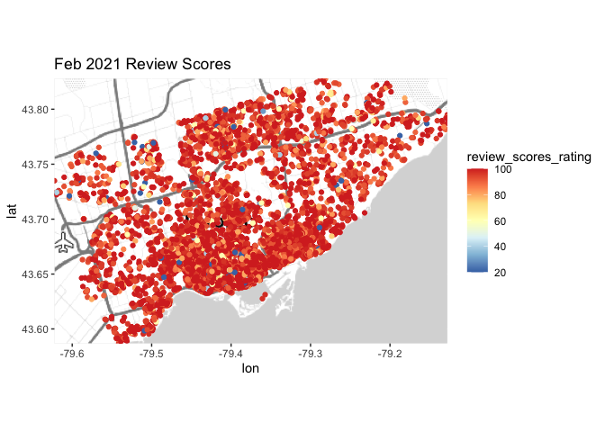
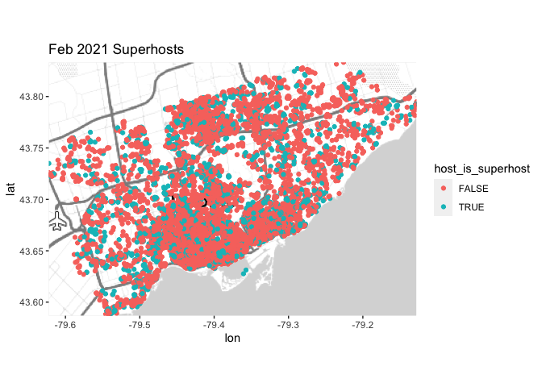
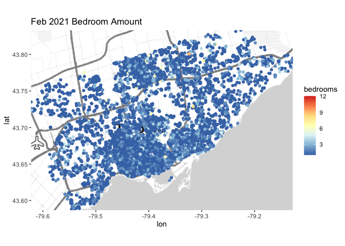
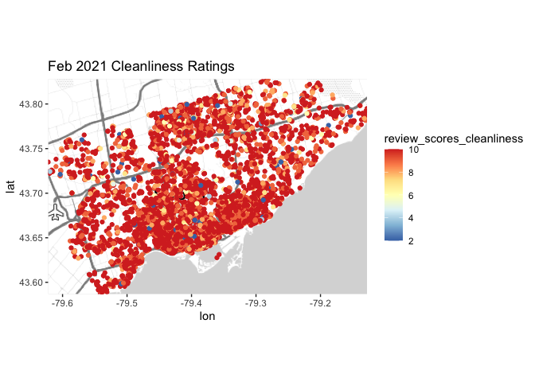

More Data Exploration
================
Henry Shiffer

# Continued Data Exploration and Variable Selection:

``` r
library(tidyverse) 
library(tidymodels) 
library(ggmap)
```

Loading Toronto’s February 2021 Airbnb data into R by:

``` r
feb_21_airbnb <- read_csv("AirbnbFebruary2021.csv", guess_max = 20000)
```

## Review Scores Map:

We can gain a view of where in Toronto has the highest and lowest Airbnb
review score ratings. To do this the NA values must be filtered out
before these values can be mapped.

``` r
#getting rid of NA values for review_scores_rating in the original data-set
rsr_filtered_airbnb <- feb_21_airbnb %>%
  filter(!is.na(review_scores_rating))

#mapping the NA value filtered review_scores_ratings values
rsr_filtered_borders <- c(bottom  = min(rsr_filtered_airbnb$latitude), 
                top = max(rsr_filtered_airbnb$latitude),
                left = min(rsr_filtered_airbnb$longitude),
                right = max(rsr_filtered_airbnb$longitude))
map1 <- get_stamenmap(rsr_filtered_borders, maptype = "toner-lite")
```

    ## Source : http://tile.stamen.com/toner-lite/10/285/373.png

    ## Source : http://tile.stamen.com/toner-lite/10/286/373.png

``` r
ggmap(map1) + geom_point(data = rsr_filtered_airbnb, mapping = aes(x = longitude, y = latitude, 
                                               col = review_scores_rating)) + scale_colour_distiller(palette = "RdYlBu") + ggtitle("Feb 2021 Review Scores")
```

<!-- -->

## Superhosts Map:

A map of superhosts would also be interesting. From the Airbnb website
(<https://www.airbnb.ca/help/article/829/how-do-i-become-a-superhost>),
a superhost is defined as a host who has met all of the following
requirements:

> “Completed at least 10 trips OR completed 3 reservations that total at
> least 100 nights”

> “Maintained a 90% response rate or higher”

> “Maintained a 1% percent cancellation rate (1 cancellation per 100
> reservations)”

> “Maintained a 4.8 overall rating (this rating looks at the past 365
> days of reviews, based on the date the guest left a review, not the
> date the guest checked out)”

If these listings have hosts that are superhosts, the listings have a
better chance of being better maintained and of higher quality to stay
in.

``` r
#getting rid of NA values for host_is_superhost in the original data-set
super_filtered_airbnb <- feb_21_airbnb %>%
  filter(!is.na(host_is_superhost))

#mapping the NA value filtered host_is_superhost values
super_filtered_borders <- c(bottom  = min(super_filtered_airbnb$latitude), 
                top = max(super_filtered_airbnb$latitude),
                left = min(super_filtered_airbnb$longitude),
                right = max(super_filtered_airbnb$longitude))
map2 <- get_stamenmap(super_filtered_borders, maptype = "toner-lite")
ggmap(map2) + geom_point(data = super_filtered_airbnb, mapping = aes(x = longitude, y = latitude, 
                                               col = host_is_superhost)) + ggtitle("Feb 2021 Superhosts")
```

<!-- -->

We can see that there does exists a good amount of superhost listings,
but ultimately it looks like there is more hosts that do not have
superhost status.

## Bedrooms Map:

To also get a sense of listing quality, we can plot bedroom amount on
the map.

``` r
#getting rid of NA values for host_is_superhost in the original data-set
bedrooms_filtered_airbnb <- feb_21_airbnb %>%
  filter(!is.na(bedrooms))

#mapping the NA value filtered host_is_superhost values
bedrooms_filtered_borders <- c(bottom  = min(bedrooms_filtered_airbnb$latitude), 
                top = max(bedrooms_filtered_airbnb$latitude),
                left = min(bedrooms_filtered_airbnb$longitude),
                right = max(bedrooms_filtered_airbnb$longitude))
map3 <- get_stamenmap(bedrooms_filtered_borders, maptype = "toner-lite")
ggmap(map3) + geom_point(data = bedrooms_filtered_airbnb, mapping = aes(x = longitude, y = latitude, 
                                               col = bedrooms)) + scale_colour_distiller(palette = "RdYlBu") + ggtitle("Feb 2021 Bedroom Amount")
```

<!-- -->

We can see an overwhelming amount of listings have less than \~5
bedrooms. This makes sense. Bedroom space is very hard to come by in the
city, and these listings reflect that.

## Cleanliness Map:

Regardless of the pandemic, cleanliness is a good indicator of Airbnb
listing quality. If a listing has low review scores for cleanliness, it
is unlikely anyone will feel comfortable living in the home.

We can gain a view of Toronto Airbnb listing cleanliness on a map of the
city.

``` r
#getting rid of NA values for review_scores_cleanliness in the original data-set
clean_filtered_airbnb <- feb_21_airbnb %>%
  filter(!is.na(review_scores_cleanliness))

#mapping the NA value filtered out review_scores_cleanliness values
clean_filtered_borders <- c(bottom  = min(clean_filtered_airbnb$latitude), 
                top = max(clean_filtered_airbnb$latitude),
                left = min(clean_filtered_airbnb$longitude),
                right = max(clean_filtered_airbnb$longitude))
map4 <- get_stamenmap(clean_filtered_borders, maptype = "toner-lite")
ggmap(map4) + geom_point(data = clean_filtered_airbnb, mapping = aes(x = longitude, y = latitude, 
                                               col = review_scores_cleanliness)) + scale_colour_distiller(palette = "RdYlBu") + ggtitle("Feb 2021 Cleanliness Ratings")
```

<!-- -->

We can see there is definitely many listings that have review scores for
cleanliness that are 6 and below. These listings are likely not very
well maintained and are possibly used just as a short-term rental
property without a host living there.

I would not recommend any listings that are below a cleanliness rating
of 6 to anyone, especially during a pandemic.
